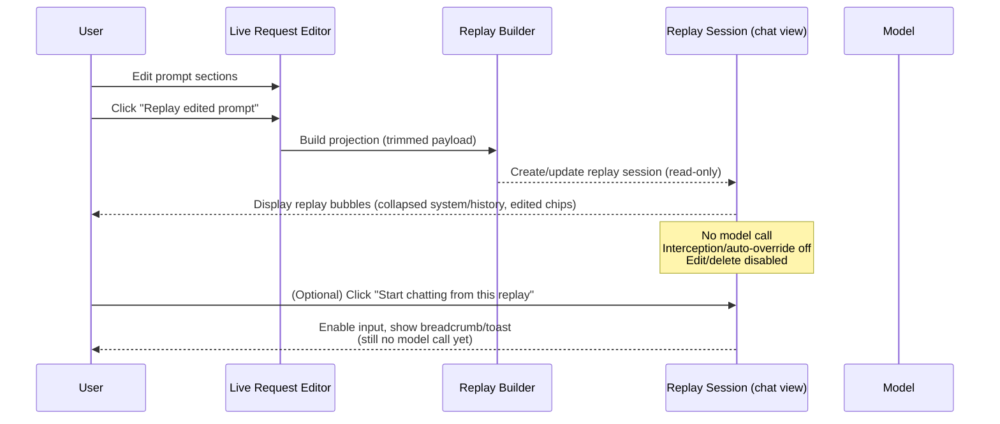
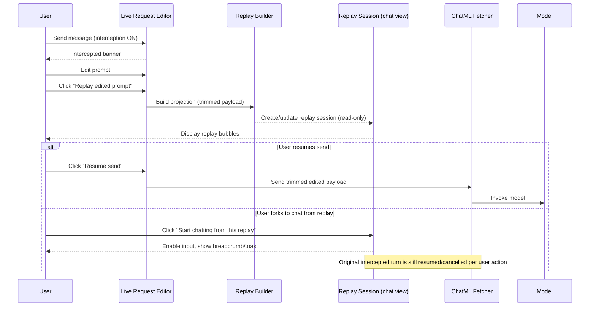
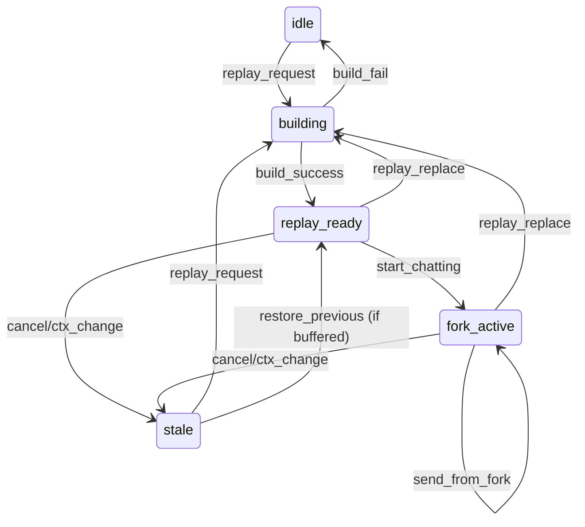

# Replay Flows & Interrupt Handling

## Use Case 1: Manual Replay (Read-only)

- User edits prompt in Live Request Editor.
- User clicks “Replay edited prompt.”
- Replay session is created (read-only); no model call.
- User reviews bubbles; may inspect diffs via hover action.
- Optional: user clicks “Start chatting from this replay” to continue in the fork.



## Use Case 2: Intercept → Replay → Resume

- User has “Pause & review” on (interception).
- Send is intercepted; LRE is focused.
- User edits; clicks “Replay edited prompt.”
- Replay session is created (read-only); user reviews.
- User resumes send (no fork), or optionally forks to continue in replay session.



## Use Case 3: Continue from Replay and Send

- User in replay session clicks “Start chatting from this replay” (input enabled).
- User composes a new message in the replay session and sends.
- Forked session uses the trimmed edited history as context; no changes to original session.

```mermaid
sequenceDiagram
    participant User
    participant RS as Replay Session (chat view, forked)
    participant Fetcher as ChatML Fetcher
    participant Model

    User->>RS: Click "Start chatting from this replay"
    RS-->>User: Enable input, show breadcrumb/toast
    User->>RS: Type new message
    User->>RS: Send message
    RS->>Fetcher: Send request (trimmed edited history + new user message)
    Fetcher->>Model: Invoke model
    Model-->>RS: Stream response
    RS-->>User: Display response
    Note over RS: Replay session only; original session untouched
```

## Replay State Machine (per source turn/session)

States:
- `idle`: no replay built.
- `building`: projection in progress.
- `replay_ready`: replay built, read-only, interception/override off, input disabled.
- `fork_active`: user chose “Start chatting from this replay”; input enabled in forked session.
- `stale`: replay invalidated (context change/cancel/re-replay).

Events/transitions:
- `replay_request` (idle/stale) → `building`
- `build_success` → `replay_ready`
- `build_fail` → `idle` (show error)
- `start_chatting` (from `replay_ready`) → `fork_active` (focus shift + breadcrumb/toast)
- `send_from_fork` (in `fork_active`) → `fork_active` (normal chat turn)
- `replay_replace` (new replay for same turn) → `building` (after marking prior stale/replaced)
- `cancel/ctx_change` → `stale` (show cleared state, disable input)
- `restore_previous` (if buffer exists) → `replay_ready` with prior version

Guards/side effects:
- Version/hash on `build_success`; ignore stale updates.
- In `replay_ready`: edit/delete disabled; input disabled; interception/override off.
- In `fork_active`: input enabled; interception/override off by default unless user toggles.
- On `stale`: show “Replay cleared” with link back to Live Request Editor.
- Cap rendering at 30 sections; compute “(N more)” overflow.



## Interrupt Handling (Graceful)

- **Empty/invalid projection**: Show “Nothing to replay” with link back to LRE; do not create replay session.
- **Mapping failure**: Show error toast; keep original session untouched.
- **Trimmed prompt**: Show banner “Prompt was trimmed; replay may omit truncated content.”
- **Interception state changes** (user cancels/turn discarded): Auto-dismiss replay session or mark it stale; keep original session intact.
- **Re-replay on same turn**: Replace existing replay (Option A); keep one-level in-memory “Restore previous replay” if persistence is off.
- **Concurrency** (multiple turns): One replay fork per source turn; labeling includes source session/turn. If user triggers replay on a new turn, switch context or show selector.
- **Interception/auto-override in fork**: Off by default; if enabled manually, re-enable edit/delete and allow normal scroll; otherwise keep edit/delete disabled and auto-scroll to latest.

## Defaults Recap
- Caps: render up to 30 sections; show “(N more)” affordance.
- Entry: explicit “Replay edited prompt” action; read-only by default.
- Continue: “Start chatting from this replay” toggles input and focus with breadcrumb/toast.
- One fork per turn; replay payload seeded from trimmed messages; projection is display-only.
