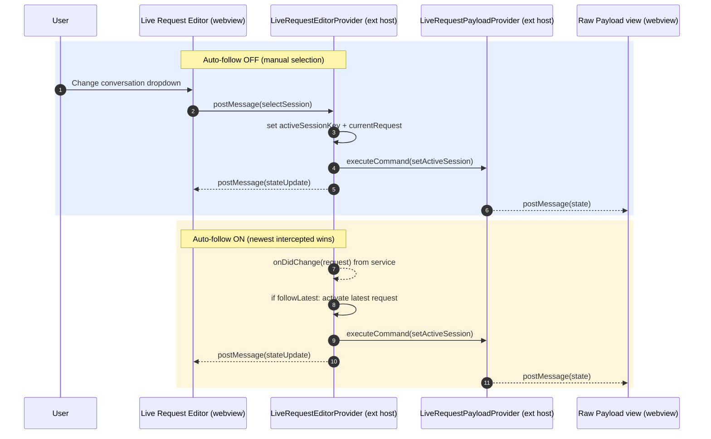

# Live Request Editor Follow Mode Change Propagation

This note captures how session/selection changes propagate between the Live Request Editor webview, the extension host, and the payload view when **Auto-follow** is on vs off.

## Flow Overview

## Mode Semantics

- **Auto-follow ON**  
  - Source of change: the newest intercepted request.  
  - Provider auto-activates the latest request (`lastUpdated`/`createdAt`) and posts `stateUpdate` (active session + payload) to the Live Request Editor webview.  
  - Provider also notifies the payload provider to render the same active session. Dropdown reflects the active session; payload flashes on change.

- **Auto-follow OFF**  
  - Source of change: user selection in the dropdown.  
  - Webview sends `selectSession` to the provider and `payload.setActiveSession` to the payload provider; followLatest is set `false`.  
  - Provider activates only the selected session and posts `stateUpdate` with `followLatest=false`. Payload provider locks to that session. Newer requests do not pre-empt until the user re-selects or re-enables follow.

## Notes / Decisions

- Provider-owned propagation is the simplest: webview emits only `selectSession` / `setFollowMode`, and the provider always forwards the active session to the payload view.  
- Checkbox text: “Auto-follow latest” (checked = follow on).  
- Visual cues: container flash on session change (when follow on); payload view flashes on payload content change.
- “Stick mode” is equivalent to Auto-follow OFF (no separate mode/button).
- Persistence is workspace-scoped for this MVP.
