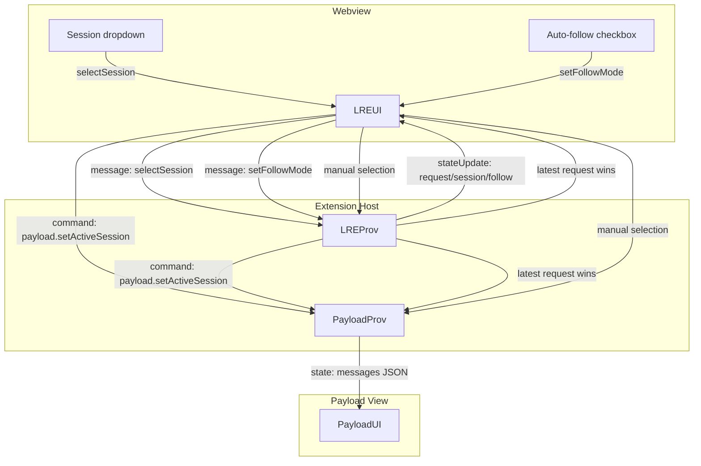

# Live Request Editor Follow Mode Change Propagation

This note captures how session/selection changes propagate between the Live Request Editor webview, the extension host, and the payload view when **Auto-follow** is on vs off.

## Flow Overview

## Mode Semantics

- **Follow ON (Auto-follow)**  
  - Source of change: the newest intercepted request.  
  - Provider auto-activates the latest request (`lastUpdated`/`createdAt`) and posts `stateUpdate` (active session + payload) to the Live Request Editor webview.  
  - Provider also notifies the payload provider to render the same active session. Dropdown reflects the active session; payload flashes on change.

- **Follow OFF (Stick)**  
  - Source of change: user selection in the dropdown.  
  - Webview sends `selectSession` to the provider and `payload.setActiveSession` to the payload provider; followLatest is set `false`.  
  - Provider activates only the selected session and posts `stateUpdate` with `followLatest=false`. Payload provider locks to that session. Newer requests do not pre-empt until the user re-selects or re-enables follow.

## Notes / Follow-ups

- Today the webview sends a direct payload sync command on selection; we can simplify by letting the provider own payload sync in both modes.  
- If we move to provider-owned sync, webview would only emit “intent” (selectSession/setFollowMode); provider always forwards the current active session to the payload provider.  
- Checkbox text: “Auto-follow latest” (checked = follow on).  
- Visual cues: container flash on session change (when follow on); payload view flashes on payload content change.

Let me know if you want the provider-only propagation (no direct webview → payload command) and I’ll update the flow accordingly.
