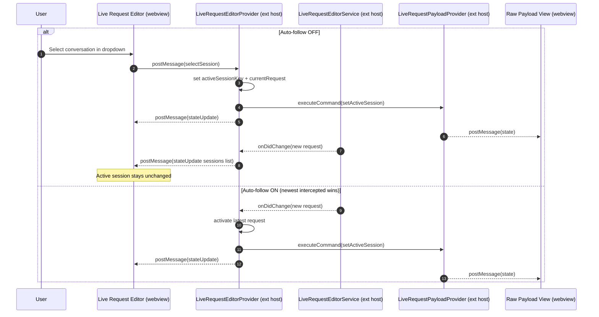

# Live Request Editor Follow Mode Change Propagation

This note captures how session/selection changes propagate between the Live Request Editor (LRE) webview, the extension host, and the raw payload view when **Auto-follow latest** is on vs off.

## Recommendation (Human Cognition)

For debugging and prompt forensics, “surprising context switches” are the biggest source of confusion: the user’s attention and mental model stay on *what they selected*, but the UI silently moves to *a different session*.

Recommendation:

- **Auto-follow OFF** should not auto-switch the active session, even if new requests arrive for other sessions.
- **Auto-follow ON** is for monitoring: the active session may switch to the newest intercepted request.
- **Make switching explicit**: the Auto-follow toggle is the only “mode switch”.

## Propagation Model (Source Of Truth)

Even though the dropdown and toggle *feel* like “two-way binding”, the implementation is the idiomatic React/extension-host pattern:

- **Extension host is the source of truth** for `activeSessionKey` and `followLatest`.
- Webviews send **events** (`selectSession`, `setFollowMode`) to request changes.
- Extension host broadcasts **state** (`stateUpdate`) back to webviews.

## Flow Overview (Mermaid)

## Decisions (Current)

- **Single mode**: “Stick” is just Auto-follow OFF (`followLatest=false`); no separate state.
- **Workspace-scoped persistence** is the default (captured requests are not global).
- **Flash cue (implemented)**: the LRE border flashes when the active session changes due to Auto-follow being ON.

## Questions For Review

- None (MVP): no separate “Jump to latest” button; use the Auto-follow switch and dropdown selection.
