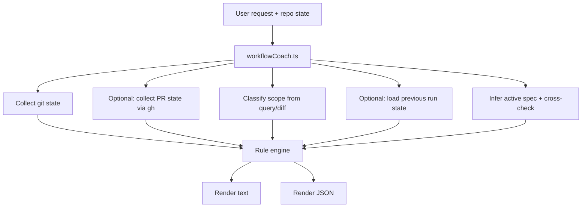

# Design Document: Workflow Coach (Agent Reminder Script)

## Overview

The repo’s workflow rules live primarily in `AGENTS.md` (spec-first, branch hygiene, “quad verification”, etc.). As the rules grow, it becomes easy for an agent (or a human driving the agent) to forget a step, mix scopes, or commit/push in the wrong order.

This feature adds a lightweight **Workflow Coach** script that:

- Reads the **current repo state** (git status, branch, staged/unstaged, upstream, PR presence).
- Accepts the **current user request** (query) and optional “context events” as inputs.
- Optionally persists **local-only** per-branch metadata (under the git common directory) so it can detect drift across restarts and git worktrees.
- Emits a **next-step reminder** and an explicit **recommended next state** (what to do next and why).
- Infers a coarse **phase** (“design” vs “implementation”) from deterministic signals (which paths are changing) so it can surface phase-appropriate reminders.

The intent is to move the operational checklist out of prose and into an executable “advisor” so the agent can re-run it at decision points (before changing scope, before committing, before pushing, before opening a PR).

### Goals

- Provide a single command that summarizes “where we are” and what to do next.
- Make “quad verification” and spec-first steps harder to forget (reminders, not enforcement).
- Detect common failure modes: committing on `main`, unpushed commits, missing PR, mixed scopes (docs + code + CI), and stale branch base.
- Detect deterministic “spec drift” signals (branch/spec mismatch, code changes without `.specs/...` updates).
- Provide heuristic phase reminders (design vs implementation) that help the agent ask clarifying questions early and follow tasks/verification once implementation begins.
- Support both **human-readable** and **machine-readable** output.
- Keep the MVP fast enough to run at workflow checkpoints (not every turn).

### Non-goals

- No automatic execution of git/CI commands (only recommendations).
- No enforcement/blocking (workflow issues never cause non-zero exits).
- No perfect semantic classification of “feature vs fix” from diffs.
- No network dependency; GitHub PR discovery is best-effort and optional.

## Current Architecture

- Workflow guidance is documented in `AGENTS.md`.
- Enforcement is mostly manual:
  - Humans or the agent remember to run lint/typecheck/compile/tests.
  - Humans or the agent decide when to split commits and when to open PRs.
  - Scope drift is handled ad hoc (stash/rebase/cherry-pick).

## Proposed Architecture

### How it fits into the “meta workflow”

- **Source of truth remains**: system/developer/user instructions + `AGENTS.md` + `.specs/...`.
- **Workflow Coach is advisory**: it helps confirm the next step you *already intend* to take is consistent with the workflow.
- **When to run (to avoid slowing work down)**:
  - Recommended checkpoints (high value / low frequency):
    - before committing
    - before pushing
    - before opening a PR
    - when switching scope or renaming branches
    - after rebases/merges that may affect PR state
  - Avoid running on every edit/turn; it is intended as a “pre-flight checklist”.
  - Provide a `--no-gh` / offline mode so PR checks can be skipped when speed matters.

### CLI surface

- Node script: `script/workflowCoach.ts` (invoked via `node --experimental-strip-types`)
- NPM entrypoints (examples):
  - `npm run workflow:coach -- --query "<user request>"`
  - `npm run workflow:coach -- --query "<...>" --json`

### Components

1. **Context collector**
   - `git`:
     - current branch
     - staged / unstaged / untracked counts
     - ahead/behind vs upstream
     - changed file list (for coarse scope heuristics)
   - optional `gh`:
     - open PR for current branch (if authenticated)
   - optional persisted state:
     - load per-branch “previous run” metadata for drift reminders
   - optional spec inference:
     - infer Active Spec from branch naming and/or `.specs/<name>/...` changes
     - check presence of `.specs/<name>/{design,requirements,tasks}.md`

2. **Request classifier (lightweight)**
   - Uses the input query to infer a probable scope type (`fix`, `feature`, `docs`, `ci`, `chore`) when possible.
   - Always allows explicit override (`--type fix`, etc.).
   - MVP expectation: inference is best-effort and primarily used to print **naming reminders**, not to auto-drive decisions.

3. **Rule engine**
   - A deterministic set of rules that produces:
     - `warnings[]` (must-read issues, e.g. “dirty main”)
     - `recommendations[]` (ordered next actions with concrete commands)
     - `suggestedNextState` (what “good” looks like next)

4. **Local state store (best-effort)**
   - Reads and writes a small JSON file under the **git common directory** so state is shared across git worktrees.
   - Stores per-branch metadata (timestamp, last inferred Active Spec, last Detected State, etc.).
   - Must not modify tracked files or git history.

5. **Renderer**
   - Text output for interactive use.
   - JSON output for tooling/future automation.

### State model (conceptual)

```ts
type WorkflowContext = {
  query?: string;
  phase?: 'design' | 'implementation';
  repo: {
    root: string;
  };
  git: {
    branch: string;
    isMainBranch: boolean;
    stagedFiles: number;
    unstagedFiles: number;
    untrackedFiles: number;
    ahead: number;
    behind: number;
    changedPaths: string[];
  };
  gh?: {
    hasAuth: boolean;
    prNumber?: number;
    prUrl?: string;
  };
  previous?: {
    lastRunAt?: string;
    lastWorkType?: string;
    lastActiveSpec?: string;
    lastDetectedState?: string;
  };
  spec?: {
    inferredFromBranch?: string;
    inferredFromChanges?: string;
    active?: string;
    hasRequiredDocs?: boolean;
  };
  phase?: 'design' | 'implementation';
};
```

### Recommendation model (conceptual)

```ts
type Recommendation = {
  id: string;
  title: string;
  why: string;
  commands?: string[];
  severity: 'info' | 'warn';
};

type CoachResult = {
  detectedState: string;
  suggestedNextState: string;
  warnings: Recommendation[];
  nextActions: Recommendation[];
};
```

## Data & Control Flow



## Rule Examples (MVP)

- **Dirty main**
  - If `branch == main` and there are changes: warn and suggest creating a new branch.
- **Uncommitted staged changes**
  - If staged changes exist: remind “quad verification” before commit (or before push if already committed).
- **Ahead of upstream**
  - If commits are not pushed: recommend `git push`.
- **No PR for branch**
  - If on non-main branch and `gh` finds no open PR: recommend creating one.
- **Scope drift heuristic**
  - If changed paths span multiple “zones” (e.g. `src/` + `.github/workflows/` + `docs/`): warn and recommend splitting via `git worktree` (preferred) or stash/cherry-pick.
- **Spec drift cross-check**
  - If branch implies spec `X` but working changes touch `.specs/Y/...`: warn about mismatch.
  - If code/build/CI changes exist without any `.specs/...` changes: warn that the spec may be stale.
- **Phase inference**
  - If working changes touch `.specs/...` without code/build/CI: treat as “design” and remind to clarify vague requirements with the human.
  - If working changes touch code/build/CI: treat as “implementation”.

## Integration Points

- `package.json` scripts to run the coach quickly.
- `AGENTS.md` can be shortened to “run the coach at decision points” plus the spec-first requirements.
- Git hooks (pre-commit / pre-push) to run the coach at workflow checkpoints (default: non-blocking).
  - Optional enforcement via environment variables and `--fail-on` (selected warning IDs).

## Migration / Rollout Strategy

- Land as opt-in tooling (no enforcement).
- Document recommended usage in `AGENTS.md`.
- Iterate rule set as new workflow pain points appear.

## Performance / Reliability / Security / UX Considerations

- Keep runtime < ~500ms in typical repos (avoid deep git history walks).
- Operate offline; `gh` integration should be best-effort (skip if unauthenticated).
- Persisted state reads/writes should be small, atomic, and best-effort (never fail the run).
- Do not print secrets; only show safe repo metadata (branch names, counts, paths).

## Risks and Mitigations

- **Noisy rules**: keep warnings limited; allow `--quiet` / `--no-gh` toggles.
- **Heuristic misclassification**: always treat scope/type inference as advisory; allow explicit override.
- **Cross-platform path handling**: normalize paths; avoid bash-specific parsing in the script itself.

## Future Enhancements

- Interactive mode that can generate a suggested branch name from the query.
- “Plan-mode” integration: emit a suggested `update_plan` skeleton for the agent.
- Optional “snapshot/export” mode for committing a coach run summary into the repo for remote review.
- Optional stronger enforcement once the rule set stabilizes (e.g. default fail-on sets; CI integration).
