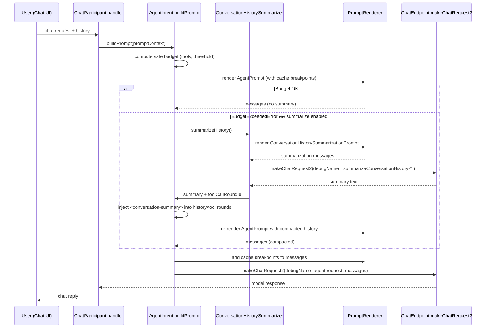

# Agent Conversation Summarization Pipeline

This document explains how the agent compacts conversation history, when it triggers, and what gets sent in the final request payload. The user-facing chat transcript is unchanged; summarization only affects the prompt sent to the model.

## Key components
- `ChatSummarizerProvider` (`src/extension/prompt/node/summarizer.ts`): Implements `vscode.ChatSummarizer` and can produce a standalone summary (used for delegation/PR context), but not for UI rendering.
- `ConversationHistorySummarizer` and `ConversationHistorySummarizationPrompt` (`src/extension/prompts/node/agent/summarizedConversationHistory.tsx`): Build a summarization prompt, call the model to compress earlier turns/tool calls, and inject a `<conversation-summary>` metadata tag.
- `AgentIntent` (`src/extension/intents/node/agentIntent.ts`): Tries to render the agent prompt; on budget overflow and if summarization is enabled, it triggers the summarizer, re-renders with compacted history, and sends the final request.
- Registration: The default agent wires in the summarizer via `defaultAgent.summarizer` (`src/extension/conversation/vscode-node/chatParticipants.ts`).

## When summarization happens
- Enabled by `chat.summarizeAgentConversationHistory.enabled` (default: true).
- Triggered when rendering the agent prompt would exceed the token budget. The summarizer runs as an internal preflight request, replaces older tool-call rounds with a summary, and retries rendering.
- The chat view still shows the original turns; only the prompt sent to the model is compacted.

## Settings of interest
- `chat.summarizeAgentConversationHistory.enabled`
- `chat.advanced.summarizeAgentConversationHistoryThreshold`
- `chat.advanced.agentHistorySummarizationMode` (simple vs full)
- `chat.advanced.agentHistorySummarizationWithPromptCache`
- `chat.advanced.agentHistorySummarizationForceGpt41`

## Tag markers in prompts
- The `<Tag name='…'>` component (`src/extension/prompts/node/base/tag.tsx`) renders literal markers into the prompt (e.g., `<analysis>…</analysis>`), optionally with attributes (e.g., `<attachment id="foo">`). It’s not HTML; it’s structured text to guide the LLM and keep sections well-delineated.
- Rendering details: validates tag names, stringifies attrs, wraps children between opening/closing markers, and uses `KeepWith` to avoid line breaks between markers and content. Empty tags with only attrs render as self-closing markers.
- Scope: The prompt layer under `src/extension/prompts/node` currently uses ~207 distinct tag names (found via `rg -o "Tag name='[^']+'" src/extension/prompts/node | sort | uniq | wc -l`). Examples include `analysis`, `summary`, `conversation-summary`, `attachments`, `toolUseInstructions`, `context`, `userPrompt`, `workspace_info`, etc.
- Output form: The TSX `<Tag name='instruction'>…</Tag>` renders to `<instruction>…</instruction>` in the final prompt text (and JSON payload). You won’t see `<Tag …>` in the wire payload—only the rendered markers.
- Purpose and scope: These markers exist solely to structure LLM input (think “LLM-friendly section markers”), not to drive UI. They aren’t ChatML/HTML/React features; they’re a prompt authoring helper in `@vscode/prompt-tsx`.

## Who builds and sends the request payload
- Prompt render: `AgentIntent.buildPrompt` (`src/extension/intents/node/agentIntent.ts`) calls `PromptRenderer` on `AgentPrompt`, producing a `RenderPromptResult` with `messages` (and, if summarization ran, a `<conversation-summary>` block in place of older turns).
- Summarization path: On budget overflow, `AgentIntent` invokes `ConversationHistorySummarizer` to get a summary, injects it into history/tool rounds, then re-renders `AgentPrompt` to produce the compacted `messages`.
- Final send: `AgentIntent` adds cache breakpoints and calls `endpoint.makeChatRequest2` (from `ChatEndpoint` in `src/platform/endpoint/node/chatEndpoint.ts`), passing the `messages` array and request options.
- Wire shape: `ChatEndpoint` hands off to the `chatMLFetcher`, which builds the API body via `createMessagesRequestBody`/`createResponsesRequestBody` (see `src/platform/endpoint/node/messagesApi.ts` / `responsesApi.ts`). The tags are already rendered as plain markers (e.g., `<analysis>…</analysis>`); no extra processing happens downstream.
- Model-agnostic: The same rendered `messages` go to whichever model endpoint is selected (OpenAI-style, Anthropic Messages API, etc.); tags are just text structure for the LLM.

## System summarization prompt (as shipped)
The system message sent when summarizing history (from `SummaryPrompt` in `src/extension/prompts/node/agent/summarizedConversationHistory.tsx`):

```
Your task is to create a comprehensive, detailed summary of the entire conversation that captures all essential information needed to seamlessly continue the work without any loss of context. This summary will be used to compact the conversation while preserving critical technical details, decisions, and progress.

## Recent Context Analysis
Pay special attention to the most recent agent commands and tool executions that led to this summarization being triggered. Include:
- Last Agent Commands: What specific actions/tools were just executed
- Tool Results: Key outcomes from recent tool calls (truncate if very long, but preserve essential information)
- Immediate State: What was the system doing right before summarization
- Triggering Context: What caused the token budget to be exceeded

## Analysis Process
Before providing your final summary, wrap your analysis in `<analysis>` tags to organize your thoughts systematically:
1. Chronological Review …
2. Intent Mapping …
3. Technical Inventory …
4. Code Archaeology …
5. Progress Assessment …
6. Context Validation …
7. Recent Commands Analysis …

## Summary Structure
<Tag name='analysis'>…</Tag>
<Tag name='summary'>
 1. Conversation Overview …
 2. Technical Foundation …
 3. Codebase Status …
 4. Problem Resolution …
 5. Progress Tracking …
 6. Active Work State …
 7. Recent Operations …
 8. Continuation Plan …
</Tag>

## Quality Guidelines
- Precision, Completeness, Clarity, Verbatim Accuracy, Technical Depth, Logical Flow.
```

## Flow (budget exceeded path)


## Request payload highlights
- The final payload is the AgentPrompt-rendered `messages` array sent via `makeChatRequest2`. If summarization ran, older rounds are replaced by a `<conversation-summary>` block; recent tool-call rounds remain intact.
- Summarization requests use `debugName="summarizeConversationHistory-*"` and run against the configured endpoint (`copilot-fast` or forced `gpt-4.1` per settings), with `tool_choice: none` in full mode.
