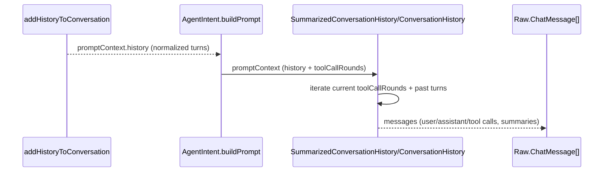

# Agent Conversation History Rendering

This doc summarizes how conversation history is stored and rendered into the agent prompt (no UI rendering). Paths: `src/extension/prompt/node/chatParticipantRequestHandler.ts`, `src/extension/prompts/node/agent/summarizedConversationHistory.tsx`, `src/extension/intents/node/agentIntent.ts`.

## Key data structures
- `IBuildPromptContext` (agent prompt context):
  - `history`: array of normalized turns (past turns).
  - `toolCallRounds`: current-turn tool-call rounds (if in a tool-calling loop).
  - `toolCallResults`, `isContinuation`, `tools`, `chatVariables`, etc.
- Normalized turn shape (produced by `addHistoryToConversation`):
  - `rounds`: per-turn array of tool-call rounds (`toolCalls`, `messages`, optional `summary`, `thinking`, metadata).
  - `resultMetadata`: includes tool results, flags (e.g., `maxToolCallsExceeded`), etc.
  - `isContinuation`: whether this turn was rolled forward.

## Rendering flow
1) `AgentIntent.buildPrompt` constructs `promptContext` (fills `history`, `toolCallRounds`, etc.).
2) `SummarizedConversationHistory` / `ConversationHistory` (`src/extension/prompts/node/agent/summarizedConversationHistory.tsx`) walk:
   - Current `toolCallRounds` (current turn)
   - Past `history` turns (normalized)
   They emit `Raw.ChatMessage` content via helper components: `ChatToolCalls`, `AgentUserMessage`, `SummaryMessageElement`, etc.
3) Summaries: if a prior summarization exists, `SummaryMessageElement` renders `<conversation-summary>…</conversation-summary>` instead of earlier raw turns. Current rounds remain verbatim unless summarized.
4) Current tool calls: `ChatToolCalls` renders tool calls and results from `toolCallRounds` (current turn) or from each turn’s `rounds` if iterating history.

## Sequence diagram (render path)

## Notes on fidelity
- The renderer consumes the normalized `promptContext.history`; it doesn’t rebuild from UI state. All per-turn/tool-call info is already in that structure when rendering starts.
- If a summary exists, raw turns before it are replaced by `<conversation-summary>…</conversation-summary>`; those raw details are not in the rendered prompt.
