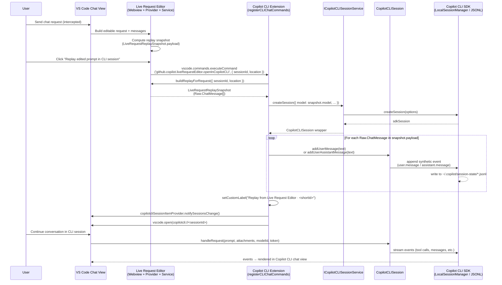
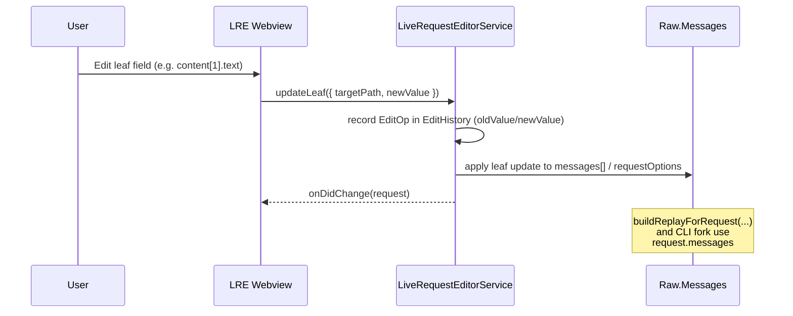

# Handoff: CLI History Replay + Session Rename + `[object Object]` Cleanup

This doc summarizes the current state of the **Copilot CLI history replay sample**, **CLI session rename**, and the **`[object Object]`** handling work, with links to all relevant specs and implementation files.

All links are relative and clickable in VS Code.

---

## 1. Specs and Requirements

- CLI history replay + rename design:
  - `.specs/cli-history-replay/design.md`  
    `.specs/cli-history-replay/design.md#L1`
- Requirements (including manual title rename):
  - `.specs/cli-history-replay/requirements.md`  
    `.specs/cli-history-replay/requirements.md#L1`
- Implementation tasks:
  - `.specs/cli-history-replay/tasks.md`  
    `.specs/cli-history-replay/tasks.md#L1`

These specs define:

- Creating a new Copilot‑CLI session and seeding it from an existing session’s history (replay sample).
- Allowing manual rename of CLI sessions (title/tab label) with UI and persistence requirements.
- Non‑string content handling in CLI history (avoid `[object Object]`).

---

## 2. CLI History Replay Sample

The sample command creates a **new** Copilot‑CLI session and seeds it with a synthetic history derived from another session.

- Command contribution:
  - `package.json` (command + menu):
    - Command: `github.copilot.cli.sessions.replaySampleNative`  
      `package.json#L1840`
    - `chat/chatSessions` menu entry gated on `chatSessionType == copilotcli`  
      `package.json#L4797`

- Core implementation:
  - `src/extension/chatSessions/vscode-node/copilotCLIChatSessionsContribution.ts`  
    `src/extension/chatSessions/vscode-node/copilotCLIChatSessionsContribution.ts#L380`

Key points in `registerCLIChatCommands`:

- Locate source session id:
  - `SessionIdForCLI.parse(sessionItem.resource)`
- Open source session read‑only:
  - `copilotCLISessionService.getSession(sourceId, { readonly: true, ... }, token)`
- Extract:
  - `sourceHistory = sourceSession.getChatHistory()`
  - `sourceModelId = await sourceSession.getSelectedModelId()`
  - `sourceOptions = sourceSession.options` (isolation, working directory)
- Create a **new** session:
  - `copilotCLISessionService.createSession({ model: sourceModelId, workingDirectory, isolationEnabled, agent: undefined }, token)`
- Replay user/assistant turns via synthetic messages:
  - For `ChatRequestTurn2` → `newSession.addUserMessage(text)`
  - For `ChatResponseTurn2` → concatenate Markdown parts and call `newSession.addUserAssistantMessage(text)`
- Append a short explanatory pair of turns so the new session is self‑describing:
  - User: “Explain what this Copilot CLI replay sample session is doing.”
  - Assistant: Markdown explanation that:
    - Identifies the session as created by the replay sample command.
    - States that the original session is not modified.
    - Notes that structured/non‑text responses are rendered as `[non-text content]` instead of `[object Object]`.
- Refresh + open:
  - `copilotcliSessionItemProvider.notifySessionsChange()`
  - `vscode.commands.executeCommand('vscode.open', newResource)`

This sample is **read‑only** with respect to the source session and uses the same SDK pipeline that normal CLI sessions use.

Replay markdown extraction bug:

- Root cause for seeing `[non-text content]` when replaying a replayed sample:
  - `ChatResponseMarkdownPart.value` is a `MarkdownString` object, not a plain string.
  - The original replay implementation concatenated these values directly and passed them into `addUserAssistantMessage(...)`, which implicitly coerced them to the string `"[object Object]"`.
  - Our placeholder logic then treated that literal `"[object Object]"` as non‑text on the *next* replay, so the assistant bubbles showed `[non-text content]`.
- Fix:
  - In `src/extension/chatSessions/vscode-node/copilotCLIChatSessionsContribution.ts#L1026`, we now unwrap the underlying string from `ChatResponseMarkdownPart.value` (handling both `string` and `{ value: string }` shapes) before calling `addUserAssistantMessage(...)`.
  - This preserves the original markdown text across multiple replays and avoids introducing new `"[object Object]"` artifacts.

Known limitation: agent vs CLI session parity

- Today, the replay sample only has access to the **Copilot CLI session event log** (via `ICopilotCLISession.getChatHistory()` and the underlying JSONL in `~/.copilot/session-state`).
- Some responses you see in the chat UI (for example, a code-generation joke with a C++ snippet that references `github.copilot.chat.codeGeneration.instructions`) may be produced by a **higher-level agent / Live Request Editor session** with its own session id (e.g. `218fcb3b-…`), and are not currently written back into the CLI JSONL.
- As a result:
  - The CLI replay sample will faithfully replay what is in the CLI JSONL (e.g. greetings, prompt inspector output, replay explanations).
  - It cannot yet include agent-only turns like the C++ joke, because there is no established mapping from the agent session id back to the corresponding CLI session id, nor a hook that mirrors the agent’s final assistant text into the CLI session via `addUserAssistantMessage(...)`.
- Requirement 7 in `.specs/cli-history-replay/requirements.md` tracks this as future work; implementing it will require new cross-session wiring between the agent pipeline and `CopilotCLISession`.

---

## 3. `[object Object]` Handling in CLI History

We saw CLI responses rendered as:

> GitHub Copilot: \[object Object]

This comes from the **CLI history reconstruction**, not the model, when `event.data.content` is a non‑string.

- History builder:
  - `src/extension/agents/copilotcli/common/copilotCLITools.ts`  
    `src/extension/agents/copilotcli/common/copilotCLITools.ts#L280`

Relevant logic:

- For `user.message`:
  - We coerce:
    ```ts
    const rawContent = event.data.content;
    const content = typeof rawContent === 'string' ? rawContent : '';
    ```
  - Uses `content` for `extractChatPromptReferences`, `getRangeInPrompt`, and `stripReminders`.

- For `assistant.message` (updated):
  - We now normalize non‑string content and literal `[object Object]` strings to a **placeholder**:
    ```ts
    const rawContent = event.data.content;
    let content: string;
    if (typeof rawContent === 'string') {
      content = rawContent === '[object Object]' ? '[non-text content]' : rawContent;
    } else {
      content = rawContent ? '[non-text content]' : '';
    }
    if (content) {
      const { cleanedContent, prPart } = extractPRMetadata(content);
      …
      currentResponseParts.push(
        new ChatResponseMarkdownPart(new MarkdownString(cleanedContent))
      );
    }
    ```

Effect:

- If the SDK sends an object/array for `event.data.content`, we now show:
  - `GitHub Copilot: [non-text content]`
  - instead of `GitHub Copilot: [object Object]`.
- If the SDK (or prior layers) send a **literal** string `'[object Object]'`, we also treat that as non‑text and render `[non-text content]` instead of echoing it.
- For normal string content, behavior is unchanged.

Tests:

- `src/extension/agents/copilotcli/common/test/copilotCLITools.spec.ts`  
  `src/extension/agents/copilotcli/common/test/copilotCLITools.spec.ts#L80`

Added test:

- “renders placeholder for non-string content instead of [object Object]”
  - Constructs events with object `content` for user and assistant messages.
  - Asserts that the markdown part includes `[non-text content]` and never `[object Object]`.
- “renders placeholder when assistant content is literal [object Object] string”
  - Asserts that when `event.data.content === '[object Object]'`, the rendered markdown also shows `[non-text content]`.

Live streaming path:

- `src/extension/agents/copilotcli/node/copilotcliSession.ts`  
  `src/extension/agents/copilotcli/node/copilotcliSession.ts#L120`
- In the `assistant.message` event listener used for **live streaming**:
  - We normalize both non‑string `event.data.content` and the literal `'[object Object]'` string to `[non-text content]` before calling `stream.markdown(...)`.
  - This ensures the live CLI chat output and the reconstructed history are consistent.

Note: this logic affects **CLI session history and live streaming** (including the CLI replay sample). Sessions that previously surfaced `[object Object]` purely because of non‑text `content` (or a literal `'[object Object]'` string) will now render `[non-text content]` instead when their history is rebuilt.

---

## 4. Live Request Editor → Copilot CLI Fork (Replay from Edited Prompt)

This section documents the new path that lets you **fork** from an edited prompt in the Live Request Editor into a **new Copilot CLI session**, seeded with the same replay payload that would be sent to the LLM, and then continue natively as a CLI session.

### 4.1 Specs and requirements

- Requirement 8 – Replay edited prompt into new CLI session from Live Request Editor:  
  `.specs/cli-history-replay/requirements.md#L93`
- Tasks for the implementation (command, wiring, tests):  
  `.specs/cli-history-replay/tasks.md#L38`
- High-level design note under “Future Enhancements”:  
  `.specs/cli-history-replay/design.md#L152`

Key design decisions:

- **Do not** replay raw OpenAI / agent JSON into the CLI SDK.
- Treat the **Live Request Editor replay payload** (`Raw.ChatMessage[]`, built via `buildReplayForRequest(...)`) as the source of truth for the edited prompt + answer you see in the inspector.
- Render each `Raw.ChatMessage` to plain text using the same rules as the replay payload view.
- Seed a **new** Copilot CLI session’s history with synthetic messages:
  - User roles → `addUserMessage(...)`
  - Assistant / system / other visible roles → `addUserAssistantMessage(...)`
- After seeding, open that session in the normal Copilot CLI chat editor and let the user continue via `handleRequest(...)` as usual.

### 4.2 Command surface and wiring

- Command contribution:
  - `package.json#L1876`  
    Command id: `github.copilot.liveRequestEditor.openInCopilotCLI`
  - Localized title:  
    `package.nls.json#L136`  
    `"github.copilot.liveRequestEditor.openInCopilotCLI": "Open Replay in Copilot CLI Session"`

- Live Request Editor webview button:
  - `src/extension/prompt/webview/vscode/liveRequestEditor/main.tsx#L1180`  
    Inside the Replay metadata row:
    ```tsx
    <vscode-button appearance="secondary" onClick={handleReplay}>
      Replay edited prompt
    </vscode-button>
    <vscode-button appearance="secondary" onClick={handleReplayInCli}>
      Replay edited prompt in CLI session
    </vscode-button>
    ```
  - Handler:
    ```tsx
    const handleReplayInCli = React.useCallback(() => {
      if (!request) {
        return;
      }
      sendMessage('command', {
        command: 'github.copilot.liveRequestEditor.openInCopilotCLI',
        args: [{ sessionId: request.sessionId, location: request.location }]
      });
    }, [request, sendMessage]);
    ```
    This sends a `LiveRequestSessionKey` into the extension host, without going through the Live Replay chat provider.

- CLI side wiring:
  - `src/extension/chatSessions/vscode-node/chatSessions.ts#L63`  
    Injects `ILiveRequestEditorService` into the Copilot CLI instantiation service:
    ```ts
    const copilotCLISessionService = copilotcliAgentInstaService.invokeFunction(accessor => accessor.get(ICopilotCLISessionService));
    const liveRequestEditorService = copilotcliAgentInstaService.invokeFunction(accessor => accessor.get(ILiveRequestEditorService));
    …
    this._register(registerCLIChatCommands(
      copilotcliSessionItemProvider,
      copilotCLISessionService,
      gitService,
      liveRequestEditorService
    ));
    ```
  - `src/extension/chatSessions/vscode-node/copilotCLIChatSessionsContribution.ts#L908`  
    `registerCLIChatCommands` now accepts `liveRequestEditorService: ILiveRequestEditorService`.

### 4.3 CLI fork handler and message rendering

- Handler registration:
  - `src/extension/chatSessions/vscode-node/copilotCLIChatSessionsContribution.ts#L1048`

```ts
disposableStore.add(vscode.commands.registerCommand(
  'github.copilot.liveRequestEditor.openInCopilotCLI',
  async (arg?: LiveRequestReplayKey | { sessionId: string; location: number }) => {
    if (!arg) {
      return;
    }

    let snapshot = 'requestId' in arg
      ? liveRequestEditorService.getReplaySnapshot(arg)
      : liveRequestEditorService.buildReplayForRequest({ sessionId: arg.sessionId, location: arg.location });

    if (!snapshot && 'requestId' in arg) {
      snapshot = liveRequestEditorService.buildReplayForRequest({ sessionId: arg.sessionId, location: arg.location });
    }

    if (!snapshot || !snapshot.payload || snapshot.payload.length === 0) {
      vscode.window.showInformationMessage(vscode.l10n.t('Nothing to replay for this request.'));
      return;
    }

    const cancellationSource = new vscode.CancellationTokenSource();
    const newRef = await copilotCLISessionService.createSession(
      {
        model: snapshot.model,
        workingDirectory: undefined,
        isolationEnabled: false,
        agent: undefined
      },
      cancellationSource.token
    );

    const newSession = newRef.object;

    try {
      for (const message of snapshot.payload ?? []) {
        const text = renderReplayMessageText(message).trim();
        if (!text) {
          continue;
        }
        if (message.role === Raw.ChatRole.User) {
          newSession.addUserMessage(text);
        } else {
          newSession.addUserAssistantMessage(text);
        }
      }

      const shortId = newSession.sessionId.slice(-6);
      const label = vscode.l10n.t('Replay from Live Request Editor · {0}', shortId);
      await copilotcliSessionItemProvider.setCustomLabel(newSession.sessionId, label);

      copilotcliSessionItemProvider.notifySessionsChange();
      const newResource = SessionIdForCLI.getResource(newSession.sessionId);
      await vscode.commands.executeCommand('vscode.open', newResource);
    } finally {
      newRef.dispose();
    }
  }
));
```

- Message rendering helper (aligned with Live Replay view rules):
  - `src/extension/chatSessions/vscode-node/copilotCLIChatSessionsContribution.ts#L1226`

```ts
function renderReplayMessageText(message: Raw.ChatMessage): string {
  const pieces: string[] = [];
  for (const part of message.content ?? []) {
    const unknownPart = part as {
      text?: unknown;
      content?: unknown;
      type?: unknown;
      toolCallId?: unknown;
    };
    if (part.type === Raw.ChatCompletionContentPartKind.Text) {
      pieces.push(part.text ?? '');
    } else if ('text' in part && typeof part.text === 'string') {
      pieces.push(part.text);
    } else if (typeof unknownPart.content === 'string') {
      pieces.push(unknownPart.content);
    } else if (unknownPart.type === 'image_url') {
      pieces.push('[image]');
    } else if (unknownPart.toolCallId) {
      pieces.push(`Tool call: ${unknownPart.toolCallId}`);
    }
  }
  return pieces.join('\n');
}
```

This mirrors `LiveReplayChatProvider._renderMessageText(...)` so that the forked CLI session shows the same visible content that the user would see in the Live Request Editor replay payload view.

### 4.4 End‑to‑end flow diagram

The following Mermaid sequence diagram shows the full path from an intercepted chat request, through the Live Request Editor, into a forked Copilot CLI session:



### 4.5 Tests

Targeted unit coverage for this path:

- **Live Replay summary button wiring**
  - `src/extension/prompt/vscode-node/test/liveReplayChatProvider.spec.ts#L146`
    - Verifies the payload-only fork history semantics (user/assistant synthetic pairs) independent of CLI.

- **Manifest declares the command**
  - `src/extension/prompt/vscode-node/test/liveReplayRegistration.spec.ts#L40`
    - Asserts that `package.json` contributes `github.copilot.liveRequestEditor.openInCopilotCLI` alongside the other Live Replay commands.

- **CLI fork command behavior**
  - `src/extension/chatSessions/vscode-node/test/copilotCLIReplayFromLiveReplay.spec.ts#L1`
    - Mocks:
      - `ICopilotCLISessionService.createSession`
      - `ILiveRequestEditorService.getReplaySnapshot`
      - `ILiveRequestEditorService.buildReplayForRequest`
      - `CopilotCLIChatSessionItemProvider.setCustomLabel` and `notifySessionsChange`
      - `vscode.commands.executeCommand`
    - Positive paths:
      - When invoked with a `LiveRequestReplayKey`, confirms `createSession` is called with the snapshot’s model and default CLI options and that the new session receives the expected `addUserMessage(...)` / `addUserAssistantMessage(...)` calls.
      - When invoked with a `{ sessionId, location }` session key, confirms `buildReplayForRequest(...)` is used to obtain the payload and seed the CLI session.
      - In both cases, verifies:
        - `setCustomLabel(newSession.sessionId, 'Replay from Live Request Editor · …')` is invoked.
        - A `vscode.open` call targets a `copilotcli://<sessionId>` resource.
    - Negative path:
      - When no snapshot can be obtained, no session is created and `vscode.window.showInformationMessage('Nothing to replay for this request.')` is called.

Repo verification notes (Dec 2025):

- `npm run test:unit` currently has upstream timeouts (known flaky suites). Recent failures include:
  - `src/platform/notebook/test/node/alternativeContent.spec.ts`
  - `src/extension/prompts/node/agent/test/agentPrompt.spec.tsx`
  - `src/extension/prompts/node/agent/test/parseAttachments.spec.ts`
  - `src/extension/prompts/node/agent/test/summarization.spec.tsx`
  - `src/extension/typescriptContext/serverPlugin/src/node/test/simple.spec.ts`

This completes the “fork from edited prompt into a native Copilot CLI session” story: the forked session’s history matches what the user saw in the Live Replay payload view, and subsequent turns run through the standard Copilot CLI session / JSONL pipeline.

---

## 5. Live Request Editor Leaf Editing (Overview)

While this handoff focuses on CLI history replay and CLI forks, the Live Request Editor’s editing semantics directly affect what gets replayed into CLI sessions. This section summarises the **per-leaf editing** design so future work on replay and persistence can assume a stable Raw payload model.

- Requirements:
  - `.specs/request-logger-prompt-editor/requirements.md#L246` (Requirement 15 – Surgical Payload Editing Fidelity)
- Detailed viewmodel:
  - `.specs/request-logger-prompt-editor/design.md#L639` (Editing Model and Undo/Redo)
- Raw schema + behaviour:
  - `.specs/cli-history-replay/Live-Request-Editor-Raw-Payload-Schema.md#L1`

### 5.1 Leaf edits vs Raw payload

- **Current implementation (UI semantics)**:
  - Unedited messages: `Raw.ChatMessage` is a deep clone of the original prompt renderer output.
  - Edited fields:
    - The webview exposes **leaf editors** for individual fields, for example:
      - `messages[i].content[j].text`
      - `messages[i].toolCalls[k].function.arguments`
      - `messages[i].name`
      - `requestOptions.temperature`
    - Each edit maps 1:1 to that field in `EditableChatRequest.messages` or `EditableChatRequest.metadata.requestOptions`.
  - Hierarchical view:
    - Each `Raw.ChatMessage` renders as a “big card” with nested child boxes for message fields (`role`, `name`, `toolCallId`), `content[i]`, `toolCalls[i]`, and other structured metadata.
    - Keys are used as headers and leaf values (strings/numbers/booleans/null) are directly editable; non-leaf values (objects/arrays) appear as foldable groups whose children expose additional leaf editors.
  - Guarantees:
    - Raw schema correctness (`role` and `content` always valid).
    - All non-edited fields (including non-text parts and message metadata) are preserved.
    - This is what `buildReplayForRequest(...)` and the CLI fork command see.

### 5.2 Sequence overview

The following diagram shows how a leaf edit flows from the LRE webview down to the Raw payload used by replay and CLI forks:



This is intentionally a **viewmodel-only** concern; `ChatMLFetcher`, CLI replay, and future persistence layers consume only the recomposed `Raw.ChatMessage[]` and do not need to know about the edit log.

## 6. CLI Session Rename (Titles / Labels)

We added a CLI‑specific rename flow that:

- Allows renaming Copilot‑CLI sessions from the sessions view context menu.
- Persists titles per session id.
- Updates both the sessions list label and (as far as current APIs allow) the chat editor tab.

### 6.1 Command + Menu

- Command:
  - `github.copilot.cli.sessions.rename`  
    `package.json#L1840`
- Menu:
  - `chat/chatSessions`:
    ```json
    {
      "command": "github.copilot.cli.sessions.rename",
      "when": "chatSessionType == copilotcli",
      "group": "context@5"
    }
    ```
    `package.json#L4797`

### 6.2 Provider: custom labels + persistence

- `CopilotCLIChatSessionItemProvider`:
  - File:  
    `src/extension/chatSessions/vscode-node/copilotCLIChatSessionsContribution.ts#L185`

Key pieces:

- In‑memory label map:

  ```ts
  private readonly _customLabels = new Map<string, string>();
  ```

- Persist in `globalState` under `github.copilot.cli.sessionLabels`:

  ```ts
  constructor(
    readonly worktreeManager: CopilotCLIWorktreeManager,
    @ICopilotCLISessionService private readonly copilotcliSessionService: ICopilotCLISessionService,
    @ICopilotCLITerminalIntegration private readonly terminalIntegration: ICopilotCLITerminalIntegration,
    @IGitService private readonly gitService: IGitService,
    @IRunCommandExecutionService private readonly commandExecutionService: IRunCommandExecutionService,
    @IVSCodeExtensionContext private readonly extensionContext: IVSCodeExtensionContext,
  ) {
    super();
    …
    const storedLabels = this.extensionContext.globalState
      .get<Record<string, string>>('github.copilot.cli.sessionLabels', {});
    for (const [id, label] of Object.entries(storedLabels)) {
      this._customLabels.set(id, label);
    }
  }
  ```

- Setter:

  ```ts
  public async setCustomLabel(sessionId: string, label: string): Promise<void> {
    this._customLabels.set(sessionId, label);
    const payload: Record<string, string> = {};
    for (const [id, lbl] of this._customLabels) {
      payload[id] = lbl;
    }
    await this.extensionContext.globalState.update('github.copilot.cli.sessionLabels', payload);
    this.notifySessionsChange();
  }
  ```

- Using custom labels when building items:

  ```ts
  const label = this._customLabels.get(session.id) ?? session.label;
  ```

### 6.3 Rename handler

- In `registerCLIChatCommands`:
  - `src/extension/chatSessions/vscode-node/copilotCLIChatSessionsContribution.ts#L931`

Flow:

```ts
disposableStore.add(vscode.commands.registerCommand('github.copilot.cli.sessions.rename', async (sessionItem?: vscode.ChatSessionItem) => {
  if (!sessionItem?.resource) {
    return;
  }

  const sessionId = SessionIdForCLI.parse(sessionItem.resource);
  const currentLabel = sessionItem.label ?? sessionId;
  const newLabel = await vscode.window.showInputBox({
    prompt: vscode.l10n.t('Rename Copilot CLI session'),
    value: currentLabel,
    ignoreFocusOut: true
  });

  const trimmed = newLabel?.trim();
  if (!trimmed) {
    return;
  }

  await copilotcliSessionItemProvider.setCustomLabel(sessionId, trimmed);
  const modified: vscode.ChatSessionItem = {
    ...sessionItem,
    label: trimmed
  };
  copilotcliSessionItemProvider.swap(sessionItem, modified);
  await vscode.commands.executeCommand('vscode.open', sessionItem.resource);
}));
```

So renaming:

- Persists the new label.
- Refreshes the sessions list via `notifySessionsChange()`.
- Fires `swap(original, modified)` to tell VS Code the item changed (helps open editors pick up the new label).
- Reopens the session resource to resync the chat editor.

**Important limitation:** the chat editor tab header ultimately comes from VS Code core logic for the `copilotcli` session type; we can only influence it indirectly via the item and reopen. There is no dedicated “tab title” API for chat editors in this repo.

---

## 7. Replay View vs CLI History

There are two separate places where `[object Object]` can appear; only one is under our control:

- **CLI chat sessions** (and the CLI replay sample):
  - Controlled by `buildChatHistoryFromEvents` (fixed to use `[non-text content]` placeholder).
  - Affects:
    - CLI sessions in the Background Agent view.
    - The CLI replay sample we added.

- **Live Request Editor / Replay view** (`copilot-live-replay`):
  - History reconstruction is via:
    - `src/extension/prompt/vscode-node/liveReplayChatProvider.ts`  
      `src/extension/prompt/vscode-node/liveReplayChatProvider.ts#L180`
  - `_renderMessageText(...)` extracts text from `Raw.ChatMessage` parts and will ignore non‑string `content`, so `[object Object]` should not be introduced here; if it is, it’s likely from previously recorded text, not new replay logic.

If you still see `[object Object]` in **replay sessions**, check whether it is coming from old logs or from non‑CLI sources (default Copilot chat). New CLI sessions and the CLI replay sample should now show `[non-text content]` instead.

---

## 8. Open Questions / Follow‑ups

1. **Generic session rename**:
   - Current rename is CLI‑specific. Extending it to cloud or replay sessions would require:
     - Provider‑specific label maps and persistence.
     - Design decisions (e.g. PR titles vs user overrides).

2. **Chat editor tab header**:
   - We still don’t have a true API to set per‑session tab titles for chat editors.
   - Current behavior relies on:
     - Updating `ChatSessionItem` metadata.
     - Letting VS Code re‑create or refresh the editor.

3. **Replay `[object Object]`**:
   - If this continues to appear from non‑CLI sources, we’d need a dedicated pass over `LiveReplayChatProvider._renderMessageText(...)` to add similar placeholders for structured content.

This handoff should give the next engineer enough context to:

- Adjust the CLI replay sample behavior.
- Evolve the rename flow or replicate it for other session types.
- Further harden history rendering against non‑string data. 
