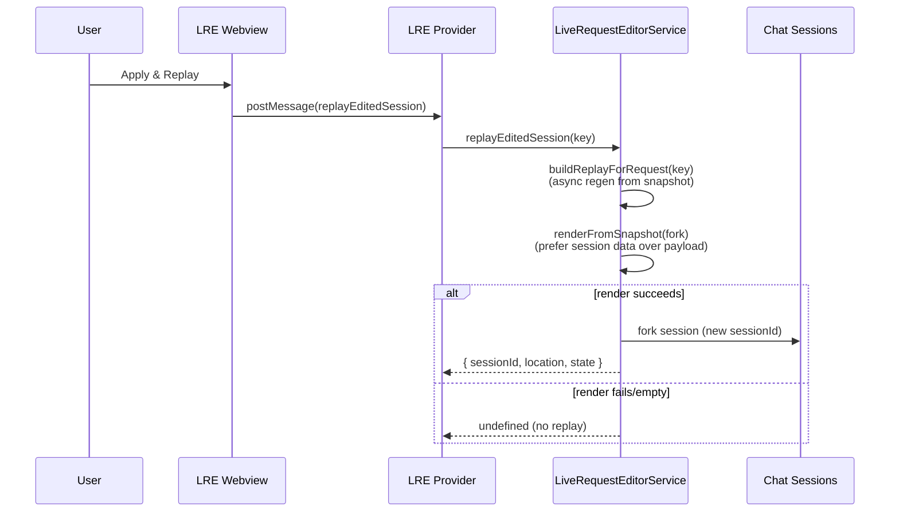

# Live Request Editor – Session Snapshot flow

This note documents the new session-based snapshot plumbing in the Live Request Editor, where to find it in the UI, and how the edited snapshot is reapplied to the prompt and replayed.

## Where the Session Snapshot lives

- Gated by `github.copilot.chat.advanced.livePromptEditorEnabled`.
- Open the Live Request Editor webview; expand the **Session Snapshot** panel (right column). It shows a pruned `IBuildPromptContext` + `requestOptions` + endpoint info as JSON with an **Apply to prompt** button.
- Snapshots are kept in-memory only; they are stripped before persistence and refreshed on each render.

## Data flow (normal apply)

```mermaid
flowchart TD
  ctx[Chat session state<br/>(Conversation + IBuildPromptContext)] --> snap[Capture & prune<br/>SessionSnapshot]
  snap --> render[renderFromSnapshot<br/>AgentPrompt + customizations]
  render --> sections[EditableChatRequest<br/>sections + messages]
  sections --> editor[Live Request Editor UI<br/>section edits + deletes]
  editor --> send[getMessagesForSend<br/>(blocking regen)]
  send --> chatML[ChatMLFetcher / createRequestBody<br/>(final request)]
  snap --> view[Session Snapshot panel<br/>JSON textarea]
  view --> snapapply[Apply to prompt]
  snapapply --> render
```

Notes:
- `renderFromSnapshot` resolves `PromptRegistry` customizations for the endpoint and blocks send; if render fails we fall back to the last render result and log a warning.
- Snapshot rendering prunes host-bound fields so the JSON is webview-safe and reversible.

## Replay flow (forking a session)



Current limitation: the fork does not yet auto-send the regenerated payload; it only seeds a new session (using the snapshot-preferred render) and marks lineage.

## Manual verification checklist

1) Enable the advanced flag, open a chat, type a prompt.  
2) Open the Live Request Editor webview → expand **Session Snapshot**. Confirm JSON shows turns/toolCallRounds/requestOptions.  
3) Edit snapshot JSON (e.g., tweak user content), click **Apply to prompt**. The sections/prompt re-render should reflect the change (no warning banner).  
4) Send the request; confirm the edited prompt is used (check Request Logger or chat response).  
5) Invoke **Apply & Replay**: a new chat session should open with a forked session id. (Payload send is best-effort TBD.)  

## Known gaps / next steps

- No structured session editor yet (raw JSON only).  
- Replay fork does not send/stream the regenerated payload; lineage telemetry is minimal.  
- Snapshot parity telemetry and UI around render fallback are still TODO.  
- Leaf-level/hierarchical editing and undo/redo remain the preferred long-term UX.  
