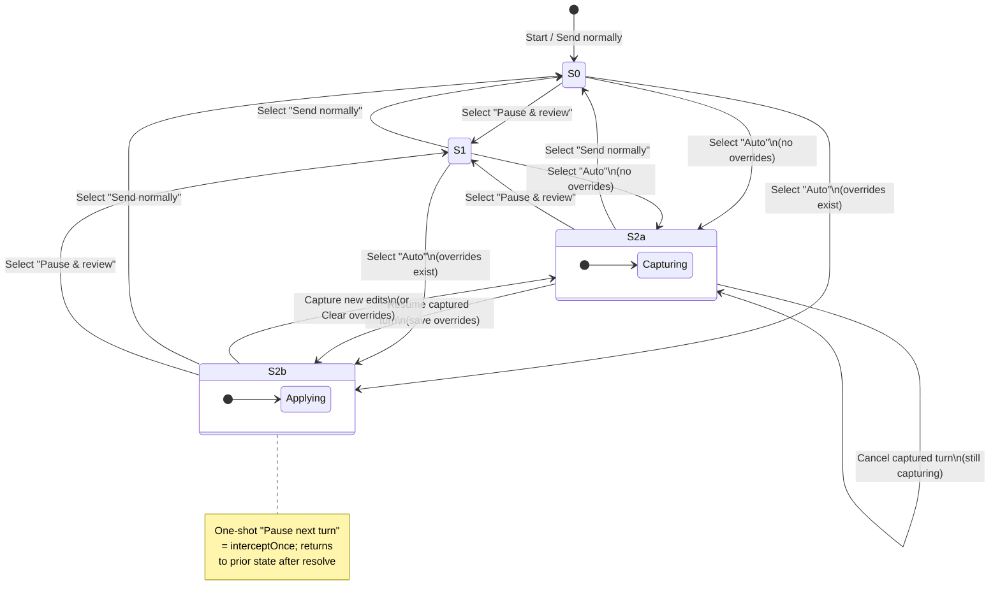

# Live Request Editor – Mode State Machine

## State/Event Table

States:
- **S0**: Send normally (`off`)
- **S1**: Pause & review every turn (`interceptAlways`)
- **S2a**: Auto (Capturing) — `autoOverride`, `capturing=true`
- **S2b**: Auto (Applying) — `autoOverride`, `capturing=false`, `hasOverrides=true`
- **S1\***: One-shot “Pause next turn” (`interceptOnce`, transient on top of prior mode)

| Current | Event | Guard/Context | Next | Actions |
|---------|-------|---------------|------|---------|
| S0 | Select “Pause & review” | – | S1 | mode=interceptAlways; clear pending; emit state |
| S0 | Select “Auto” w/ overrides | hasOverrides | S2b | mode=autoOverride; capturing=false |
| S0 | Select “Auto” w/out overrides | !hasOverrides | S2a | mode=autoOverride; capturing=true (arm pause) |
| S1 | Select “Send normally” | – | S0 | mode=off; cancel pending |
| S1 | Select “Auto” w/ overrides | hasOverrides | S2b | mode=autoOverride; capturing=false; keep pending if active (save on resume) |
| S1 | Select “Auto” w/out overrides | !hasOverrides | S2a | mode=autoOverride; capturing=true; keep pending if active |
| S2a | Resume intercepted turn | – | S2b | save overrides (scope), capturing=false |
| S2a | Cancel intercepted turn | – | S2a | pending cleared; capturing stays true (will pause next turn) |
| S2a | Clear saved edits | overrides exist | S2a | remove overrides; capturing=true |
| S2a | Select “Send normally” | – | S0 | mode=off; cancel pending |
| S2b | Capture new edits | – | S2a | capturing=true (arm next pause) |
| S2b | Clear saved edits | – | S2a | remove overrides; capturing=true |
| S2b | Select “Pause & review” | – | S1 | mode=interceptAlways |
| S2b | Select “Send normally” | – | S0 | mode=off |
| Any | Pause next turn (one-shot) | – | S1\* | mode=interceptOnce; after resolve → prior mode |
| Any | Feature disabled | – | S0 | clear state; cancel pending |

## State Diagram

## Button enable/disable guidance
- Header mode toggle buttons:
  - Disable “Auto-apply saved edits” when the feature flag `...autoOverride.enabled` is false.
  - Active state should follow the current mode (map `interceptOnce` → “Pause & review” for display).
- Auto banner buttons:
  - “Capture new edits”: disable while already capturing.
  - “Pause next turn”: hide/disable while capturing (since next turn is already armed).
  - “Remove saved edits”: disable when there are no overrides.
  - “Where to save edits” and “Sections to capture”: always enabled when Auto is enabled.
- Interception banners:
  - When mode=off, hide the interception banner entirely.
  - When mode=auto and not capturing, hide the “pending/ready” pause banner.

## Known issues to fix
- Saved overrides are now gated: `applyAutoOverridesForRequest` only runs in Auto mode; “Send normally” and “Pause & review” bypass overrides.
- Auto-apply feature flag changes respect existing overrides (don’t re-arm capture when overrides exist).
- Switching to Off while a pause is pending still cancels and discards the paused edits (expected, but should be communicated in UI copy).
