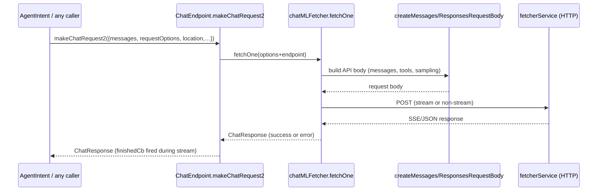

# `makeChatRequest` / `makeChatRequest2` walkthrough

This doc describes what goes into `ChatEndpoint.makeChatRequest(2)` and what comes out. Paths: `src/platform/endpoint/node/chatEndpoint.ts`, `src/platform/chat/common/commonTypes.ts`, `src/platform/endpoint/node/messagesApi.ts`, `src/platform/endpoint/node/responsesApi.ts`.

## Inputs (IMakeChatRequestOptions)
- `debugName`: string for logging/telemetry.
- `messages`: `Raw.ChatMessage[]` (system/user/assistant/tool-call messages with `content` parts). Produced by prompt renderers (e.g., `AgentIntent` + `PromptRenderer`).
- `location`: `ChatLocation` enum (panel, inline, agent, etc.) for routing/telemetry.
- Optional:
  - `requestOptions`: sampling/tools/etc. (`temperature`, `stream`, `tools`, `tool_choice`, `top_p`, `max_tokens`, etc.).
  - `finishedCb`: callback invoked on streamed chunks.
  - `source`: extension/agent source identifier.
  - `telemetryProperties`, `userInitiatedRequest`, `ignoreStatefulMarker` (defaults true), `finishedCb`, `enableRetryOnFilter`, `tool_choice`, `tools`, etc.

### `messages` shape (Raw.ChatMessage)
Each entry has a `role` (`system`/`user`/`assistant`), optional `toolCalls`, and `content` parts (text, images, opaque/thinking). During prompt rendering, TSX `<Tag>` components are already flattened into literal markers (e.g., `<analysis>…</analysis>`).

## Outputs
- `ChatResponse` (`FetchResponse<string>`):
  - Success: `{ type: Success, value: string, usage, requestId, serverRequestId, resolvedModel }`
  - Errors: union of `ChatFetchResponseType` cases (rate limited, filtered, canceled, networkError, badRequest, unknown, etc.). See `ChatFetchError` in `commonTypes.ts`.
- Streaming: `finishedCb` receives progressive text/tool-calls; the final `ChatResponse` still resolves to a single string or error envelope.

## Execution path
1) Caller (e.g., `AgentIntent`):
   - Render prompt → `messages`.
   - Call `endpoint.makeChatRequest` (wrapper) → `makeChatRequest2`.
2) `ChatEndpoint.makeChatRequest2`:
   - Delegates to `_makeChatRequest2` with `ignoreStatefulMarker` defaulted to true.
3) `_makeChatRequest2`:
   - Calls `chatMLFetcher.fetchOne` with `options + endpoint`.
4) `chatMLFetcher.fetchOne`:
   - Builds request body via `createMessagesRequestBody` or `createResponsesRequestBody` depending on model/endpoint (OpenAI-style or Anthropic Messages API), normalizes tool calls, strips sampling params for o1-like models, attaches auth/telemetry headers.
   - Sends HTTP request via `fetcherService`.
5) Response handling:
   - Streams are parsed by `SSEProcessor` or Anthropic `messagesApi` processor; non-streaming paths parse JSON (`defaultNonStreamChatResponse`).
   - Tool calls normalized (`toolCalls` vs `tool_calls`), usage tallied, request ids captured.
6) Return:
   - Final `ChatResponse` (success/error) to caller; `finishedCb` has already been invoked for streamed chunks.

## Sequence diagram


## Quick example (success envelope)
```json
{
  "type": "success",
  "value": "Here is the answer…",
  "usage": { "prompt_tokens": 123, "completion_tokens": 45 },
  "requestId": "client-side-id",
  "serverRequestId": "upstream-id",
  "resolvedModel": "gpt-4.1"
}
```
