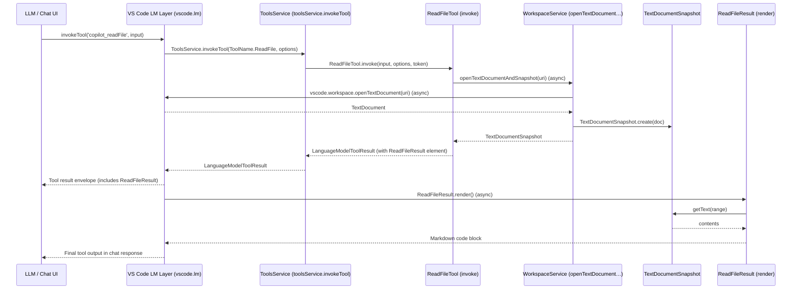
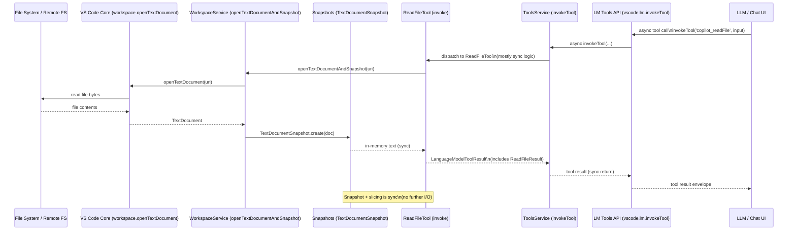

# `read_file` Tool Walkthrough (Copilot Chat)

This doc walks through the implementation of the `read_file` tool used by the Copilot Chat extension, with navigable references into this repo.

You can Ctrl/Cmd‑click any code link (e.g. [`src/extension/tools/node/readFileTool.tsx#L31`](../src/extension/tools/node/readFileTool.tsx#L31)) in VS Code (locally or in a remote/online environment) to jump to the exact line.

---

## 1. High‑level shape

The `read_file` tool is implemented as a **Copilot tool** that wraps a **language model tool**:

- Tool definition and implementation:
  - [`src/extension/tools/node/readFileTool.tsx#L31`](../src/extension/tools/node/readFileTool.tsx#L31)
- Tool registry entry:
  - [`src/extension/tools/common/toolsRegistry.ts#L52`](../src/extension/tools/common/toolsRegistry.ts#L52)
- Tool name mapping (internal ⇄ contributed):
  - [`src/extension/tools/common/toolNames.ts#L24`](../src/extension/tools/common/toolNames.ts#L24)
  - [`src/extension/tools/common/toolNames.ts#L76`](../src/extension/tools/common/toolNames.ts#L76)
- Tool invocation wiring (how Copilot / tests call it):
  - [`src/extension/tools/vscode-node/toolsService.ts#L52`](../src/extension/tools/vscode-node/toolsService.ts#L52)
  - [`src/extension/tools/node/test/readFile.spec.tsx#L46`](../src/extension/tools/node/test/readFile.spec.tsx#L46)

At runtime, the tool:

1. Resolves a `filePath` into a workspace/URI.
2. Validates the file is safe to read (ignore rules, etc.).
3. Opens a snapshot of the file (text or notebook).
4. Computes the line range to return (v1 vs v2 params, truncation).
5. Renders a `PromptElement` that produces a Markdown code block back to the LLM.

---

## 2. Tool metadata (`LanguageModelToolInformation`)

The public tool definition (name, description, JSON schema) is declared as `readFileV2Description`:

- [`src/extension/tools/node/readFileTool.tsx#L31`](../src/extension/tools/node/readFileTool.tsx#L31)

Key points:

- `name: ToolName.ReadFile` – internal enum name, mapped to/from contributed name like `copilot_readFile`.
- `description` – what the model sees; explains:
  - 1‑indexed line numbers.
  - Chunked reading via `offset` / `limit`.
  - 2000‑line truncation behavior.
- `inputSchema` – JSON schema used by the LLM:
  - `filePath: string` (absolute path).
  - `offset?: number` (1‑based starting line).
  - `limit?: number` (max lines to read).

The `ToolName` / `ContributedToolName` mapping is defined here:

- [`src/extension/tools/common/toolNames.ts#L24`](../src/extension/tools/common/toolNames.ts#L24)
- [`src/extension/tools/common/toolNames.ts#L76`](../src/extension/tools/common/toolNames.ts#L76)

This mapping ensures that:

- The model sees contributed tool names like `copilot_readFile`.
- Internally we use `ToolName.ReadFile` for routing and prompts.

---

## 3. Parameters and range handling

The tool supports two parameter shapes:

- Legacy v1 (explicit range):
  - [`src/extension/tools/node/readFileTool.tsx#L56`](../src/extension/tools/node/readFileTool.tsx#L56)
- v2 (offset/limit, preferred):
  - [`src/extension/tools/node/readFileTool.tsx#L62`](../src/extension/tools/node/readFileTool.tsx#L62)

These are unified via:

- `ReadFileParams` union and `isParamsV2` type guard:
  - [`src/extension/tools/node/readFileTool.tsx#L70`](../src/extension/tools/node/readFileTool.tsx#L70)
- `getParamRanges(...)` helper:
  - [`src/extension/tools/node/readFileTool.tsx#L81`](../src/extension/tools/node/readFileTool.tsx#L81)

`getParamRanges`:

- Takes either v1 or v2 params plus a document snapshot.
- Computes:
  - `start` (1‑based line, clamped to file).
  - `end` (1‑based line, respecting `MAX_LINES_PER_READ`).
  - `truncated: boolean` – whether we had to clamp `limit` below what was requested.
- Validates `offset`:
  - If `offset > snapshot.lineCount`, throws a clear error (1‑indexed message).
- Ensures `start <= end` by swapping if needed.

The max‑lines limit is defined as:

- `MAX_LINES_PER_READ = 2000`:
  - [`src/extension/tools/node/readFileTool.tsx#L68`](../src/extension/tools/node/readFileTool.tsx#L68)

---

## 4. Tool implementation class

The core implementation is `ReadFileTool`, a Copilot tool that:

- Knows how to invoke the tool (`invoke`).
- Prepares user‑facing messages (`prepareInvocation`).
- Optionally overrides the LM tool definition (`alternativeDefinition`).

Entry point:

- [`src/extension/tools/node/readFileTool.tsx#L108`](../src/extension/tools/node/readFileTool.tsx#L108)

### 4.1 `invoke` – doing the read

The `invoke` method:

- Validates and resolves the `filePath`:
  - Uses `resolveToolInputPath` and `assertFileOkForTool`:
    - [`src/extension/tools/node/readFileTool.tsx#L131`](../src/extension/tools/node/readFileTool.tsx#L131)
    - [`src/extension/tools/node/toolUtils.ts#L1`](../src/extension/tools/node/toolUtils.ts#L1) (not shown here, but referenced).
- Obtains a snapshot of the target:
  - Either a `NotebookDocumentSnapshot` or a `TextDocumentSnapshot`:
    - [`src/extension/tools/node/readFileTool.tsx#L194`](../src/extension/tools/node/readFileTool.tsx#L194)
- Calls `getParamRanges` to decide `start`/`end`/`truncated`:
  - [`src/extension/tools/node/readFileTool.tsx#L81`](../src/extension/tools/node/readFileTool.tsx#L81)
- Emits telemetry:
  - `sendReadFileTelemetry(...)`:
    - [`src/extension/tools/node/readFileTool.tsx#L200`](../src/extension/tools/node/readFileTool.tsx#L200)
- Creates a `ReadFileResult` prompt element:
  - `ReadFileResult` is defined at:
    - [`src/extension/tools/node/readFileTool.tsx#L242`](../src/extension/tools/node/readFileTool.tsx#L242)
  - And rendered to JSON via:
    - `renderPromptElementJSON`:
      - [`src/extension/tools/node/readFileTool.tsx#L153`](../src/extension/tools/node/readFileTool.tsx#L153)

The `invoke` implementation is the main bridge from tool call → snapshot → prompt output.

### 4.2 `prepareInvocation` – chat UI messages

`prepareInvocation` provides user‑visible “in progress” / “done” messages in the chat UI:

- [`src/extension/tools/node/readFileTool.tsx#L156`](../src/extension/tools/node/readFileTool.tsx#L156)

Behavior:

- If reading the entire file:
  - Shows “Reading <file>” / “Read <file>”.
- If reading a range:
  - Shows “Reading <file>, lines X to Y”.
  - Uses `Location` / `Range` so the UI can jump to the right line.

This doesn’t affect the tool result itself; it just controls UX in the chat view.

### 4.3 `alternativeDefinition` – toggling v2 schema

`alternativeDefinition` optionally swaps the tool’s public schema/description:

- [`src/extension/tools/node/readFileTool.tsx#L186`](../src/extension/tools/node/readFileTool.tsx#L186)

It:

- Checks an experiment flag:
  - `ConfigKey.TeamInternal.EnableReadFileV2` via `IConfigurationService` / `IExperimentationService`.
- Returns:
  - `readFileV2Description` (v2 schema) when the experiment is enabled.
  - `originTool` (original schema) otherwise.

This allows v2 (`offset`/`limit`) to be rolled out gradually without breaking other extensions that see `vscode.lm.tools`.

---

## 5. Rendering the result

The actual text returned to the model is produced by the `ReadFileResult` prompt element:

- Class definition:
  - [`src/extension/tools/node/readFileTool.tsx#L251`](../src/extension/tools/node/readFileTool.tsx#L251)
- `render` implementation:
  - [`src/extension/tools/node/readFileTool.tsx#L260`](../src/extension/tools/node/readFileTool.tsx#L260)

Key behaviors:

- Re‑validates file access (defense in depth) via `assertFileOkForTool`.
- Special‑cases:
  - Empty file → “exists, but is empty”.
  - Whitespace‑only file → “exists, but contains only whitespace”.
- Computes a `Range` from `startLine` / `endLine` and slices text from the snapshot.
- Appends a truncation notice when `truncated === true`, e.g.:
  - `"[File content truncated at line 2000. Use read_file with offset/limit parameters to view more.]"`.
- Wraps content in a `CodeBlock`:
  - [`src/extension/tools/node/readFileTool.tsx#L282`](../src/extension/tools/node/readFileTool.tsx#L282)
  - Attaches a `PromptReference` so the file path is tracked in prompt context.

This is what ultimately becomes the Markdown the LLM sees in the tool result.

---

## 6. Registration and invocation

### 6.1 Registering the tool

At the bottom of the file:

- `ToolRegistry.registerTool(ReadFileTool);`
  - [`src/extension/tools/node/readFileTool.tsx#L239`](../src/extension/tools/node/readFileTool.tsx#L239)

The `ToolRegistry` is the central Copilot tool registry:

- [`src/extension/tools/common/toolsRegistry.ts#L52`](../src/extension/tools/common/toolsRegistry.ts#L52)

`ToolsService` then instantiates and exposes these tools:

- [`src/extension/tools/vscode-node/toolsService.ts#L39`](../src/extension/tools/vscode-node/toolsService.ts#L39)

### 6.2 Calling the tool programmatically

1. From Copilot’s internals and tests, we use `ToolsService.invokeTool`:
   - [`src/extension/tools/vscode-node/toolsService.ts#L52`](../src/extension/tools/vscode-node/toolsService.ts#L52)

2. Example from `readFile` unit tests:
   - [`src/extension/tools/node/test/readFile.spec.tsx#L46`](../src/extension/tools/node/test/readFile.spec.tsx#L46)

   ```ts
   const toolsService = accessor.get(IToolsService);

   const input: IReadFileParamsV1 = {
     filePath: '/workspace/file.ts',
     startLine: 2,
     endLine: 6
   };
   const result = await toolsService.invokeTool(
     ToolName.ReadFile,
     { input, toolInvocationToken: null as never },
     CancellationToken.None
   );
   ```

3. Under the hood, `ToolsService.invokeTool` forwards to `vscode.lm.invokeTool`:
   - [`src/extension/tools/vscode-node/toolsService.ts#L52`](../src/extension/tools/vscode-node/toolsService.ts#L52)

This is also the pattern you’d use for **manual tool calls** from other parts of the extension: get `ToolsService` from DI and call `invokeTool(ToolName.ReadFile, ...)`.

---

## 7. Tests and edge‑case behavior

The `ReadFile` tests cover:

- Normal range reads (v1 and v2).
- Empty files and whitespace‑only files.
- Large files and truncation at `MAX_LINES_PER_READ`.
- Out‑of‑bounds `offset` handling.
- Clamping `offset = 0` to line 1.

File:

- [`src/extension/tools/node/test/readFile.spec.tsx#L20`](../src/extension/tools/node/test/readFile.spec.tsx#L20)

Examples:

- Basic read:
  - [`src/extension/tools/node/test/readFile.spec.tsx#L46`](../src/extension/tools/node/test/readFile.spec.tsx#L46)
- Empty file:
  - [`src/extension/tools/node/test/readFile.spec.tsx#L65`](../src/extension/tools/node/test/readFile.spec.tsx#L65)
- Truncation:
  - [`src/extension/tools/node/test/readFile.spec.tsx#L168`](../src/extension/tools/node/test/readFile.spec.tsx#L168)
- Offset out of bounds:
  - [`src/extension/tools/node/test/readFile.spec.tsx#L185`](../src/extension/tools/node/test/readFile.spec.tsx#L185)

These tests are a good reference if you want to change behavior (e.g., different truncation rules) and see expected outputs immediately.

---

## 8. How the LLM is instructed to use `read_file`

The tool is also embedded in agent prompts so models learn when/how to call it.

Examples:

- Anthropic agent prompts:
  - [`src/extension/prompts/node/agent/anthropicPrompts.tsx#L26`](../src/extension/prompts/node/agent/anthropicPrompts.tsx#L26)
  - [`src/extension/prompts/node/agent/anthropicPrompts.tsx#L44`](../src/extension/prompts/node/agent/anthropicPrompts.tsx#L44)
- OpenAI agent prompts:
  - [`src/extension/prompts/node/agent/openai/defaultOpenAIPrompt.tsx#L36`](../src/extension/prompts/node/agent/openai/defaultOpenAIPrompt.tsx#L36)
  - [`src/extension/prompts/node/agent/openai/defaultOpenAIPrompt.tsx#L54`](../src/extension/prompts/node/agent/openai/defaultOpenAIPrompt.tsx#L54)

These prompts:

- Encourage reading enough context in one go.
- Explain the `/* lines N-M omitted */` pattern and when to use `read_file`.
- Discourage spamming `read_file` with many tiny reads.

Together with the tool’s schema and behavior, this gives the LLM a clear contract for how to fetch file contents safely and efficiently.

---

## 9. Layered architecture overview

From bottom (most foundational) to top (LLM), the `read_file` stack looks like this:

```text
OS / File System (local or remote)
  └─ VS Code core
       (vscode.workspace.openTextDocument, workspace.fs)
         └─ WorkspaceService abstraction
              src/platform/workspace/common/workspaceService.ts
              - Defines IWorkspaceService
              - openTextDocumentAndSnapshot / openNotebookDocumentAndSnapshot
                └─ Document snapshot layer
                     src/platform/editing/common/textDocumentSnapshot.ts
                     src/platform/editing/common/notebookDocumentSnapshot.ts
                     - Hold file text in-memory
                     - Provide getText(range), lineCount, etc.
                       └─ ReadFileTool (Copilot tool implementation)
                            src/extension/tools/node/readFileTool.tsx
                            - Validates input and resolves URI (toolUtils)
                            - Uses WorkspaceService to get snapshots
                            - Computes start/end via getParamRanges
                            - Emits telemetry
                            - Builds ReadFileResult prompt element
                              └─ ToolsService / LM tools adapter
                                   src/extension/tools/vscode-node/toolsService.ts
                                   - Discovers tools via ToolRegistry
                                   - Forwards calls from vscode.lm.invokeTool
                                     └─ VS Code LM tools API
                                          (vscode.lm.invokeTool, chat tool-calling loop)
                                            └─ LLM / Chat UI
                                                 - Decides when to call read_file
                                                 - Sees the Markdown result and continues reasoning
```

From the LLM’s perspective, **`ReadFileTool.invoke` plus `ReadFileResult.render` is the “real” implementation** of the `read_file` tool for this extension. There is no hidden lower‑level “magic” beyond:

- Standard VS Code services for opening documents and notebooks (e.g. `IWorkspaceService`, `INotebookService`).
- Utility helpers for path resolution and safety checks (e.g. `assertFileOkForTool`, `resolveToolInputPath`).

All of the logic about:

- How many lines to read,
- What happens when `offset` is out of bounds,
- How truncation is signaled to the model,
- How the result is formatted as Markdown,

is implemented explicitly in:

- [`src/extension/tools/node/readFileTool.tsx`](../src/extension/tools/node/readFileTool.tsx),
- plus the shared helpers it calls.

---

## 10. Sequence diagram (async flow)

The sequence below shows the **async call flow** for a `read_file` invocation triggered by the LLM:



Notes:

- All arrows with `>>` represent **async** calls returning Promises.
- The **only real I/O boundary** is `vscode.workspace.openTextDocument(uri)` inside `WorkspaceService`; everything else is pure TypeScript/JS transforming strings and building prompt elements.

---

## 11. Layer interaction diagram (sequence + async)

To tie the layered view from section 9 together with async behavior, here is a higher‑level **sequence diagram** across the main layers:



This highlights:

- Async boundaries:
  - `LLM → LM Tools API → ToolsService → ReadFileTool` (tool call).
  - `ReadFileTool → WorkspaceService → VS Code Core → File System` (document open).
- Sync, in‑memory work:
  - `Snapshots ↔ ReadFileTool` (range math, `getText(range)`).
  - Returning the tool result back up the stack.
