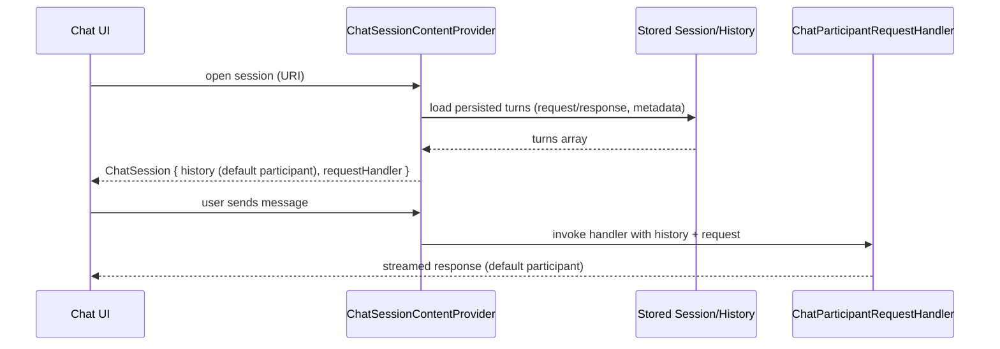

# Replay Native Parity Study

## Goal
Understand how Copilot chat renders sessions natively and how to make the replay view faithfully reproduce the original chat (requests/responses, roles, attachments, model picker) instead of the current replay-participant projection.

## What the native chat expects (sources)
- Chat sessions are provided via `ChatSessionContentProvider` with `history: ChatRequestTurn | ChatResponseTurn2` and a `requestHandler` for new turns (`src/extension/vscode.proposed.chatSessionsProvider.d.ts:170-245`).
- Session tab metadata comes from `ChatSessionItemProvider` and the contributed session type in `package.json` (chatSessions contribution at `package.json:1258+` for default Copilot participants).
- The default Copilot participant id (`github.copilot.default`) is what drives normal UI affordances (model picker, attachments, etc.).

### How native sessions build history (examples)
- Claude agent: `src/extension/chatSessions/vscode-node/claudeChatSessionContentProvider.ts` builds a `ChatSession` with history from stored session data using the agent participant id; tests at `src/extension/chatSessions/vscode-node/test/claudeChatSessionContentProvider.spec.ts` validate history shape.
- Copilot CLI: `src/extension/chatSessions/vscode-node/copilotCLIChatSessionsContribution.ts` registers item/content providers and uses `ChatSessionContentBuilder` to emit request/response turns; see `provideChatSessionContent` around history construction and `test/copilotCLIChatSessionParticipant.spec.ts` for handler expectations.
- Cloud sessions: `src/extension/chatSessions/vscode-node/copilotCloudSessionsProvider.ts` uses `ChatSessionContentBuilder` to reconstruct history from stored session info when opening a session tab.

### Request handling path
- The handler created via `ChatParticipantRequestHandler` (used by our replay) mirrors the default flow: it accepts an initial history (the payload) and runs under the default Copilot participant id (see `liveReplayChatProvider.ts:145-169`).

### Native (OpenAI/Copilot) session content builder (closest analogs)
- There is no separate “OpenAI” content provider here; the default Copilot chat uses the participant directly. The closest explicit builders are:
  - Cloud sessions: `src/extension/chatSessions/vscode-node/copilotCloudSessionsProvider.ts` uses `ChatSessionContentBuilder` to map stored turns into `ChatRequestTurn`/`ChatResponseTurn2` for the default Copilot participant (`provideChatSessionContent`).
  - Claude agent: `src/extension/chatSessions/vscode-node/claudeChatSessionContentProvider.ts` builds history from persisted session state for the Claude participant (tests at `test/claudeChatSessionContentProvider.spec.ts`).
  - CLI agent: `src/extension/chatSessions/vscode-node/copilotCLIChatSessionsContribution.ts` rebuilds history via `ChatSessionContentBuilder` for the CLI participant and tests it in `test/copilotCLIChatSessionParticipant.spec.ts`.

## Current replay behavior (code)
- Replay chat provider registers a custom scheme/participant and builds history mixing a replay summary with per-section or payload turns (`src/extension/prompt/vscode-node/liveReplayChatProvider.ts:74-200`).
- Payload continuation uses `ChatParticipantRequestHandler` but history is still emitted under a mix of replay/default participants.
- Replay resources are versioned via URI query to force refresh (`liveReplayChatProvider.ts:74-94`).
- Chat session capabilities for replay now mirror Copilot (attachments enabled) via `package.json` chatSessions entry.

## Gaps causing “non-native” feel
- History uses the replay participant and projection-derived bubbles, not the original request/response flow with the default Copilot id.
- Roles are collapsed into markdown blobs instead of reconstructing `ChatRequestTurn`/`ChatResponseTurn2` per `Raw.ChatMessage`.
- Session type remains `copilot-live-replay`, so the UI path differs from normal Copilot tabs (even if capabilities match).

## Feasibility of faithful conversion
- We already have `snapshot.payload: Raw.ChatMessage[]` (edited prompt). Mapping this directly to request/response turns with the **default Copilot participant id** reproduces native chat layout:
  - User messages → `ChatRequestTurn2` (default participant) + empty `ChatResponseTurn2`.
  - System/context/history/tool/assistant/tool-result messages → labeled `ChatRequestTurn2` + `ChatResponseTurn2` with content.
- Attachments/model picker already work if the session capabilities match and we render with the default participant id.
- Projection (sections) can be retained as an optional summary toggle; payload should be the default view for fidelity.

## Proposed solution
1) Render replay history in payload mode by default:
   - Summary bubble stays under replay participant (meta info, start-action).
   - All payload turns rendered with `github.copilot.default` so the chat looks native.
2) Add an optional toggle to switch to “Projection view” (section-level auditing) without mixing into the main stream.
3) Keep versioned URIs to refresh after edits; continue hydration from service for missing local state.
4) (Optional) Use the default Copilot session type for replay sessions to inherit all UI affordances; otherwise, ensure `copilot-live-replay` mirrors capabilities exactly.

## Comparison: Native chat vs Current replay vs Proposed

| Aspect | Native Copilot chat | Current replay | Proposed |
| --- | --- | --- | --- |
| Participant id | `github.copilot.default` for all turns | Replay participant for summary + sections; mixed in payload | Summary: replay participant; Payload: default Copilot |
| History shape | Request/response turns per message; tool calls/results inline | Summary + per-section bubbles (projection) or mixed payload | Summary bubble + full payload as request/response turns |
| Session type | Copilot chat session | `copilot-live-replay` | Keep `copilot-live-replay` but mirror capabilities; optional future: use default session type |
| UI affordances | Model picker, attachments, modes | Enabled after recent changes | Same as native (capabilities already aligned) |
| Refresh on edit | Uses stored history; normal chat | Versioned replay URI to force refresh | Keep versioned URI; rebuild payload after edit |
| Projection view | Not shown; implicit history | Inline section bubbles | Optional toggle (off by default) |

## Flow comparison (mermaid)
### Native-style session (cloud/CLI/Claude pattern)


### Current replay flow
```mermaid
sequenceDiagram
    participant LRE as LiveRequestEditor
    participant Service as LiveRequestEditorService
    participant Replay as LiveReplayChatProvider
    participant UI as Chat UI
    participant Handler as Copilot Handler
    LRE->>Service: buildReplayForRequest (payload, projection, version)
    Service-->>Replay: replay snapshot
    Replay-->>UI: open replay URI (?version=v)
    UI->>Replay: provideChatSessionContent(resource)
    Replay-->>UI: summary (replay participant) + payload turns (default Copilot participant); handler disabled
    UI->>Replay: Start chatting from this replay
    Replay->>Handler: ChatParticipantRequestHandler(history=payload, participant=default Copilot)
    Handler-->>UI: response under default participant
```

## References
- Chat session contract: `src/extension/vscode.proposed.chatSessionsProvider.d.ts:170-245`
- Replay provider registration and versioned URI: `src/extension/prompt/vscode-node/liveReplayChatProvider.ts:74-94`
- Replay content building and handler wiring: `src/extension/prompt/vscode-node/liveReplayChatProvider.ts:100-200`
- Copilot participant contributions (default agent): `package.json` around `chatParticipants` and `chatSessions` (`package.json:1258+`)
- Native session builders/tests:
  - Claude: `src/extension/chatSessions/vscode-node/claudeChatSessionContentProvider.ts`, tests at `src/extension/chatSessions/vscode-node/test/claudeChatSessionContentProvider.spec.ts`.
  - Copilot CLI: `src/extension/chatSessions/vscode-node/copilotCLIChatSessionsContribution.ts`, tests at `src/extension/chatSessions/vscode-node/test/copilotCLIChatSessionParticipant.spec.ts`.
  - Copilot cloud sessions: `src/extension/chatSessions/vscode-node/copilotCloudSessionsProvider.ts`.
