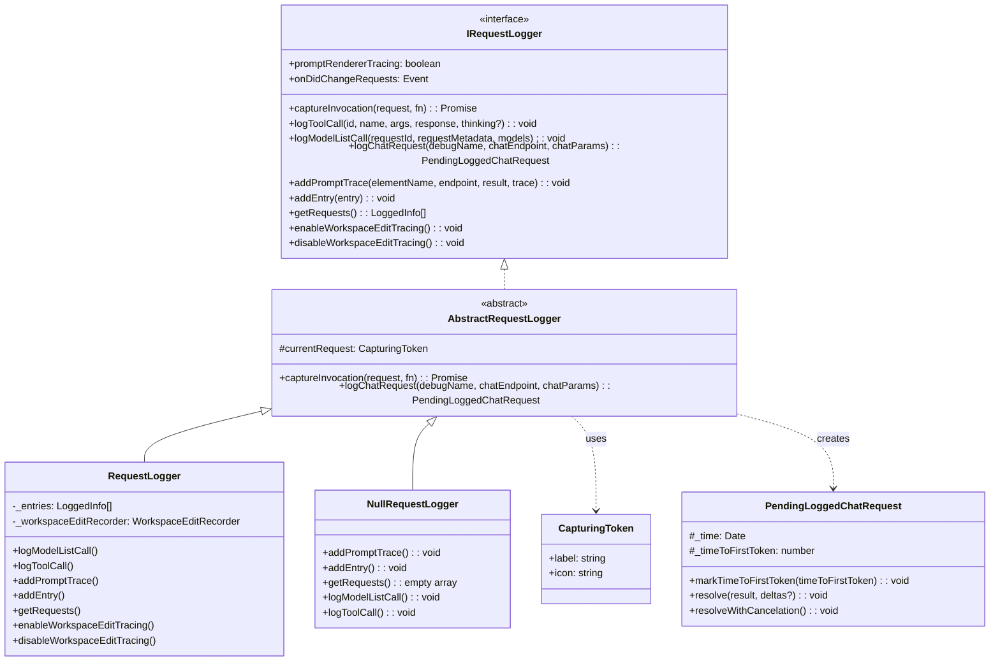
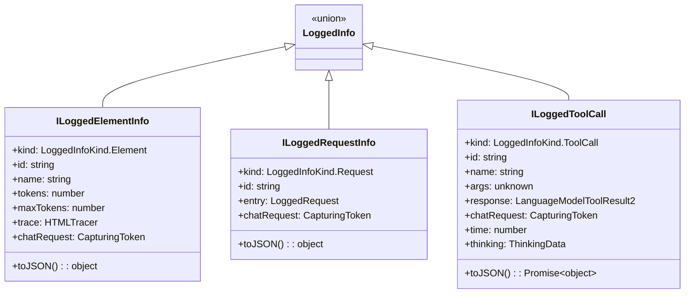
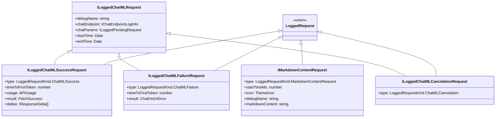
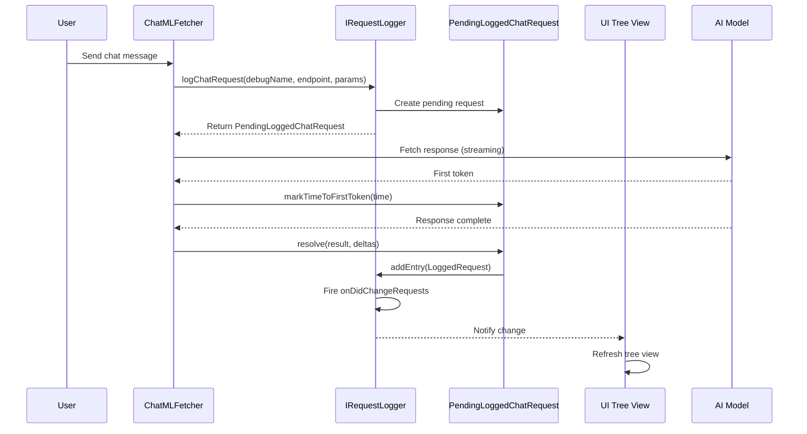
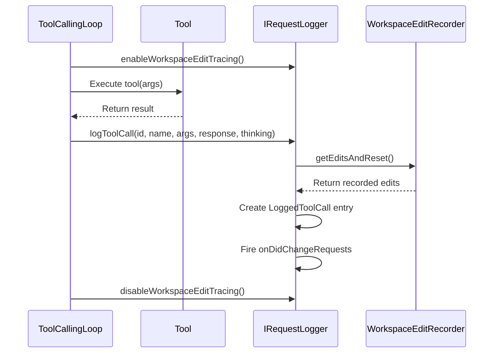
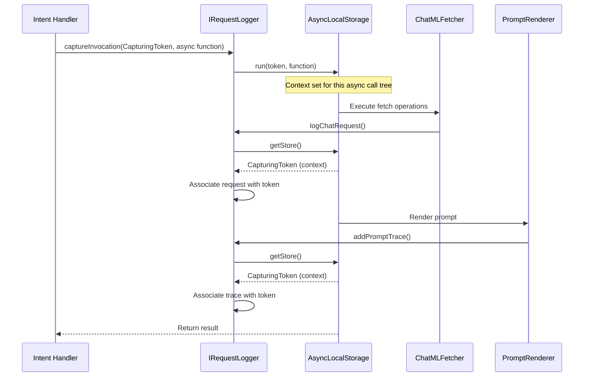
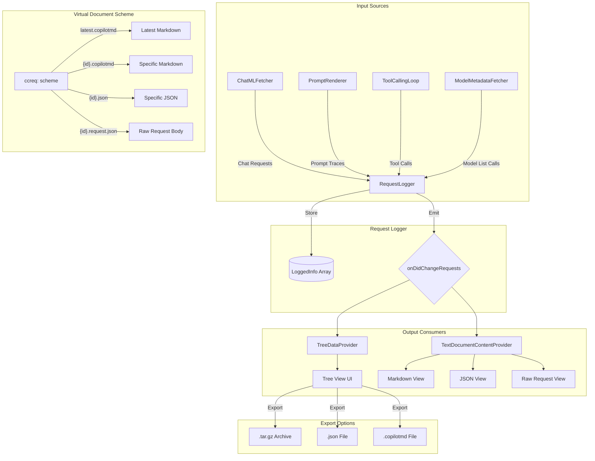
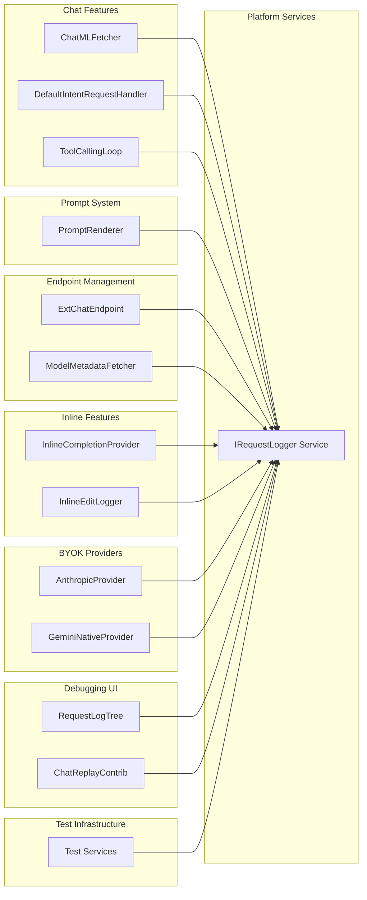

# Request Logger Documentation

## Overview

The `requestLogger` module (`src/platform/requestLogger`) is a core debugging and observability infrastructure in the GitHub Copilot Chat VS Code extension. It provides a comprehensive system for capturing, logging, and visualizing all AI model requests, tool calls, and prompt traces made during the extension's operation.

### Key Purposes

1. **Request Tracking**: Logs all chat requests made to AI language models (LLMs)
2. **Tool Call Logging**: Captures tool invocations with their arguments and results
3. **Prompt Tracing**: Records prompt rendering details with token counts
4. **Debugging Support**: Provides a tree view UI for developers to inspect request history
5. **Export Capabilities**: Allows exporting logged data in various formats (Markdown, JSON, archives)

---

## Architecture

### Module Structure

```
src/platform/requestLogger/
├── common/
│   └── capturingToken.ts        # Token for tracking request context
└── node/
    ├── requestLogger.ts          # Core interfaces and abstract implementation
    └── nullRequestLogger.ts      # No-op implementation for testing
```

### Implementation Location

The production implementation resides in:
- `src/extension/prompt/vscode-node/requestLoggerImpl.ts` - Full featured `RequestLogger` class

### UI Visualization

The tree view UI is implemented in:
- `src/extension/log/vscode-node/requestLogTree.ts` - TreeDataProvider for VS Code

---

## Class Diagram



---

## Data Types

### LoggedInfo Types



### LoggedRequest Types



---

## Sequence Diagrams

### Chat Request Logging Flow



### Tool Call Logging Flow



### Request Capture Flow (Context Tracking)



---

## Data Flow Diagram



---

## Component Interaction Diagram



---

## Public APIs

### Service Interface: `IRequestLogger`

The `IRequestLogger` is the primary service interface, registered via dependency injection.

```typescript
export const IRequestLogger = createServiceIdentifier<IRequestLogger>('IRequestLogger');

export interface IRequestLogger {
    readonly _serviceBrand: undefined;

    /**
     * Whether prompt renderer tracing is enabled (for internal users).
     */
    promptRendererTracing: boolean;

    /**
     * Captures an invocation context, allowing all nested requests
     * to be associated with a single user action.
     * 
     * @param request - Token identifying the user action
     * @param fn - Async function to execute within this context
     */
    captureInvocation<T>(request: CapturingToken, fn: () => Promise<T>): Promise<T>;

    /**
     * Logs a tool call with its arguments and response.
     */
    logToolCall(
        id: string, 
        name: string, 
        args: unknown, 
        response: LanguageModelToolResult2, 
        thinking?: ThinkingData
    ): void;

    /**
     * Logs a model list API call.
     */
    logModelListCall(
        requestId: string, 
        requestMetadata: RequestMetadata, 
        models: IModelAPIResponse[]
    ): void;

    /**
     * Logs a chat request and returns a pending request handle.
     */
    logChatRequest(
        debugName: string, 
        chatEndpoint: IChatEndpointLogInfo, 
        chatParams: ILoggedPendingRequest
    ): PendingLoggedChatRequest;

    /**
     * Adds a prompt rendering trace (HTML visualization).
     */
    addPromptTrace(
        elementName: string, 
        endpoint: IChatEndpointInfo, 
        result: RenderPromptResult, 
        trace: HTMLTracer
    ): void;

    /**
     * Adds a completed log entry.
     */
    addEntry(entry: LoggedRequest): void;

    /**
     * Event fired when requests change.
     */
    onDidChangeRequests: Event<void>;

    /**
     * Returns all logged requests.
     */
    getRequests(): LoggedInfo[];

    /**
     * Enables tracking of workspace edits for tool calls.
     */
    enableWorkspaceEditTracing(): void;

    /**
     * Disables workspace edit tracking.
     */
    disableWorkspaceEditTracing(): void;
}
```

### Virtual Document URI Scheme

The `ccreq:` URI scheme provides programmatic access to logged data:

```typescript
// Access the latest logged entry
const latestMarkdownUri = 'ccreq:latest.copilotmd';
const latestJsonUri = 'ccreq:latest.json';
const latestRawRequestUri = 'ccreq:latest.request.json';

// Access a specific entry by ID
const specificMarkdownUri = 'ccreq:abc123.copilotmd';
const specificJsonUri = 'ccreq:abc123.json';
const specificRawRequestUri = 'ccreq:abc123.request.json';

// Programmatic usage
const document = await vscode.workspace.openTextDocument(
    vscode.Uri.parse('ccreq:latest.copilotmd')
);
const content = document.getText();
```

### CapturingToken

Used to group related requests under a single user action:

```typescript
export class CapturingToken {
    constructor(
        public readonly label: string,   // Display label (e.g., user's query)
        public readonly icon: string | undefined, // ThemeIcon ID
    ) { }
}
```

---

## UI Visualization

### Tree View: "copilot-chat"

The extension provides a dedicated tree view for browsing logged requests:

**Location**: View Container > Copilot Chat Debug Panel

**Tree Structure**:
```
📁 Chat Prompt: "How do I implement sorting?"
├── 📄 defaultChat - [1,234tks] [250ms] [14:30]
├── 🔧 readFile { path: "/src/sort.ts" }
├── 🔧 runInTerminal { command: "npm test" }
└── 📄 retry-defaultChat - [800tks] [180ms] [14:31]
```

**Features**:
- Expandable prompt groups with all related requests
- Filter toggles for:
  - Elements (prompt traces)
  - Tool calls
  - NES requests (Next Edit Suggestions - inline edit predictions that suggest the next code change)
- Context menu actions:
  - Export single item as Markdown
  - Export prompt archive (.tar.gz)
  - Export as JSON for replay
  - View raw request body

### Commands

| Command | Description |
|---------|-------------|
| `github.copilot.chat.debug.exportLogItem` | Export a single log entry as Markdown |
| `github.copilot.chat.debug.exportPromptArchive` | Export all entries in a prompt as .tar.gz |
| `github.copilot.chat.debug.exportPromptLogsAsJson` | Export a prompt's logs as JSON |
| `github.copilot.chat.debug.exportAllPromptLogsAsJson` | Export all prompts as JSON |
| `github.copilot.chat.debug.saveCurrentMarkdown` | Save currently viewed markdown document |
| `github.copilot.chat.debug.showRawRequestBody` | View the raw API request body |
| `github.copilot.debug.showOutputChannel` | Show the Copilot Chat output channel |

### Filter Commands

| Command | Description |
|---------|-------------|
| `github.copilot.chat.debug.showElements` | Show element entries in tree |
| `github.copilot.chat.debug.hideElements` | Hide element entries |
| `github.copilot.chat.debug.showTools` | Show tool call entries |
| `github.copilot.chat.debug.hideTools` | Hide tool call entries |
| `github.copilot.chat.debug.showNesRequests` | Show NES request entries |
| `github.copilot.chat.debug.hideNesRequests` | Hide NES request entries |

---

## Configuration

### Settings

| Setting | Description | Default |
|---------|-------------|---------|
| `github.copilot.chat.advanced.debug.requestLogger.maxEntries` | Maximum number of entries to retain | `100` |

---

## Usage Examples

### Accessing the Service

```typescript
import { IRequestLogger } from '../platform/requestLogger/node/requestLogger';

class MyFeature {
    constructor(
        @IRequestLogger private readonly _requestLogger: IRequestLogger,
    ) { }

    async handleUserRequest(userQuery: string) {
        const token = new CapturingToken(userQuery, 'comment');
        
        return this._requestLogger.captureInvocation(token, async () => {
            // All requests made within this function will be grouped
            // under this capturing token in the debug tree view
            const result = await this.makeChatRequest();
            await this.executeToolCall();
            return result;
        });
    }
}
```

### Logging a Custom Request

```typescript
import { Codicon } from '../util/vs/base/common/codicons';

// For custom integrations
// Note: icon uses ThemeIcon which can be constructed from Codicon values
this._requestLogger.addEntry({
    type: LoggedRequestKind.MarkdownContentRequest,
    debugName: 'customOperation',
    startTimeMs: Date.now(),
    icon: Codicon.gear, // Codicon extends ThemeIcon
    markdownContent: '# Custom Operation Log\n\nDetails here...'
});
```

### Exporting Logs Programmatically

```typescript
// Export all logs as JSON
await vscode.commands.executeCommand(
    'github.copilot.chat.debug.exportAllPromptLogsAsJson',
    '/path/to/output.json'
);
```

---

## Testing

### Using NullRequestLogger

For testing, use `NullRequestLogger` which implements the interface but performs no operations:

```typescript
import { NullRequestLogger } from '../platform/requestLogger/node/nullRequestLogger';

const testServices = new ServiceCollection();
testServices.set(IRequestLogger, new NullRequestLogger());
```

---

## Best Practices

1. **Use CapturingToken** for grouping related requests - always wrap user-initiated actions
2. **Don't log sensitive data** - the request logger may expose data to users
3. **Respect max entries** - old entries are automatically pruned
4. **Enable workspace edit tracing** only when needed - it has performance overhead
5. **Use debug tools** - the tree view is invaluable for debugging request flows

---

## Related Files

| File | Purpose |
|------|---------|
| `src/platform/requestLogger/common/capturingToken.ts` | Context tracking token |
| `src/platform/requestLogger/node/requestLogger.ts` | Core interfaces and abstract class |
| `src/platform/requestLogger/node/nullRequestLogger.ts` | No-op implementation |
| `src/extension/prompt/vscode-node/requestLoggerImpl.ts` | Production implementation |
| `src/extension/log/vscode-node/requestLogTree.ts` | Tree view UI |
| `src/extension/prompt/vscode-node/workspaceEditRecorder.ts` | Edit tracking for tools |
| `src/extension/prompt/vscode-node/requestLoggerToolResult.ts` | Tool result rendering |
| `src/extension/replay/vscode-node/chatReplayContrib.ts` | Replay functionality |
