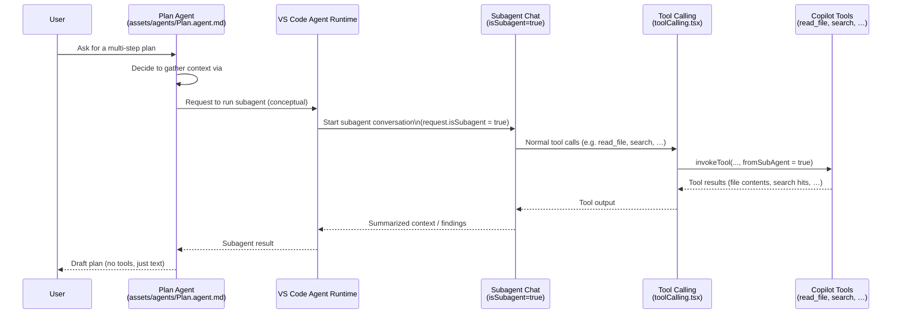

# `runSubagent` “Tool” Walkthrough (Subagent Flows)

This doc explains how the **`runSubagent`** concept works in this repo. Unlike `read_file`, `runSubagent` is **not** a normal Copilot LM tool with its own `invoke` function – it’s a *meta-tool name* that marks **subagent** conversations and tool calls.

All links below are relative and clickable in VS Code, locally or remotely.

---

## 1. What `runSubagent` is (and isn’t)

`runSubagent` appears in three places:

- As a **tool name** in the Plan agent:
  - [`assets/agents/Plan.agent.md#L1`](../assets/agents/Plan.agent.md#L1)
- As an internal **core tool name** in the tool enum:
  - [`src/extension/tools/common/toolNames.ts#L60`](../src/extension/tools/common/toolNames.ts#L60)
- As a **string identifier** advertised to prompt visualizers / context providers:
  - [`src/extension/promptFileContext/vscode-node/promptFileContextService.ts#L200`](../src/extension/promptFileContext/vscode-node/promptFileContextService.ts#L200)

However, there is **no** corresponding `ReadFileTool`‑style implementation or registration:

- There is **no** `ToolRegistry.registerTool` call for `ToolName.CoreRunSubagent` anywhere under `src/extension/tools/`.
- When the model uses `#tool:runSubagent` in the Plan agent, it’s invoking a **conceptual operation** handled by the agent runtime (VS Code’s agent/sessions infrastructure), not a Copilot LM tool implemented in this repo.

Think of `runSubagent` as:

> “Run another agent (subagent) autonomously using the same workspace tools, then return the result to me.”

not:

> “Call a concrete LM tool named `runSubagent` that does its own I/O.”

---

## 2. Where `runSubagent` shows up

### 2.1 Plan agent prompt

The Plan agent defines `runSubagent` in its `tools:` list:

- [`assets/agents/Plan.agent.md#L1`](../assets/agents/Plan.agent.md#L1)

And instructs the model:

- “MANDATORY: Run `#tool:runSubagent` tool…”:
  - [`assets/agents/Plan.agent.md#L31`](../assets/agents/Plan.agent.md#L31)

This tells the Plan agent:

- When doing **context gathering**, don’t manually call each workspace tool.
- Instead, delegate to a subagent (`runSubagent`) that can:
  - Use the same tools (`read_file`, `search`, etc.).
  - Work without pausing for user feedback.
  - Return a summarized result back to Plan.

The mapping from `#tool:runSubagent` in the agent spec → actual subagent execution is part of the **VS Code agent runtime**, not implemented directly in this repo.

### 2.2 Tool name enum

`runSubagent` is reserved as a **core tool name**:

- [`src/extension/tools/common/toolNames.ts#L60`](../src/extension/tools/common/toolNames.ts#L60)

```ts
export enum ToolName {
  // ...
  CoreRunSubagent = 'runSubagent',
  // ...
}
```

It is also categorized as a “core” tool (conceptually important, not grouped visually):

- [`src/extension/tools/common/toolNames.ts#L162`](../src/extension/tools/common/toolNames.ts#L162)

…but again, there is no `ReadFileTool`‑style implementation for this name.

### 2.3 Prompt file context / tool name list

The prompt file context service includes `runSubagent` among the known tool names used when building prompt templates:

- [`src/extension/promptFileContext/vscode-node/promptFileContextService.ts#L200`](../src/extension/promptFileContext/vscode-node/promptFileContextService.ts#L200)

```ts
private getToolNames(): string[] {
  return ['edit', 'runNotebooks', 'search', 'new', 'runCommands', 'runTasks',
          'runSubagent', 'usages', 'vscodeAPI', 'problems', 'changes',
          'testFailure', 'openSimpleBrowser', 'fetch', 'githubRepo',
          'extensions', 'todos'];
}
```

This ensures:

- `runSubagent` is recognized in prompt files / visualizers.
- Prompt‑driven agents (like Plan) can refer to it consistently.

---

## 3. Subagent flag: `isSubagent` on requests

The actual **mechanism** for subagent turns is the `isSubagent` flag on chat requests, defined in the private chat participant proposal:

- [`src/extension/vscode.proposed.chatParticipantPrivate.d.ts#L80`](../src/extension/vscode.proposed.chatParticipantPrivate.d.ts#L80)

```ts
export interface ChatRequest2 /* ... */ {
  // ...
  readonly isSubagent?: boolean;
}
```

This flag is carried through the Copilot pipeline:

- Included in the Live Request Editor model:
  - [`src/extension/prompt/common/liveRequestEditorModel.ts#L134`](../src/extension/prompt/common/liveRequestEditorModel.ts#L134)
- Passed into Live Request Editor service init:
  - [`src/extension/prompt/node/defaultIntentRequestHandler.ts#L807`](../src/extension/prompt/node/defaultIntentRequestHandler.ts#L807)
  - [`src/extension/prompt/node/liveRequestEditorService.ts#L220`](../src/extension/prompt/node/liveRequestEditorService.ts#L220)

Several pieces of logic branch on `isSubagent`:

- **Skip prompt interception** for subagent requests:
  - [`src/extension/prompt/node/defaultIntentRequestHandler.ts#L539`](../src/extension/prompt/node/defaultIntentRequestHandler.ts#L539)
- **Compute debug name** as `tool/runSubagent` for subagent fetches:
  - [`src/extension/prompt/node/defaultIntentRequestHandler.ts#L910`](../src/extension/prompt/node/defaultIntentRequestHandler.ts#L910)
- **Do not auto‑apply overrides** for subagent turns:
  - [`src/extension/prompt/node/liveRequestEditorService.ts#L1389`](../src/extension/prompt/node/liveRequestEditorService.ts#L1389)

From the Live Request Editor’s perspective, subagent requests:

- Are treated as **“background automation”**:
  - No interception pauses.
  - No auto‑override mutations applied.
  - Still tracked for metadata and debugging (debug name, traces).

The behavior matrix for interception explicitly calls out subagent requests:

- [`docs/live-request-editor-interception-consistency.md#L40`](../docs/live-request-editor-interception-consistency.md#L40)

> Subagent (`isSubagent`) request starts → *no cancellation*; interception is skipped.

---

## 4. Tool calls from subagents (`fromSubAgent`)

When a subagent turn *does* call other tools (like `read_file`), those LM tools are invoked normally, but marked as “from a subagent”:

- The panel tool‑calling code sets `fromSubAgent` if the prompt context belongs to a subagent:
  - [`src/extension/prompts/node/panel/toolCalling.tsx#L214`](../src/extension/prompts/node/panel/toolCalling.tsx#L214)

```ts
const invocationOptions: LanguageModelToolInvocationOptions<unknown> = {
  input: inputObj,
  toolInvocationToken: props.toolInvocationToken,
  tokenizationOptions,
  chatRequestId: props.requestId
};
if (props.promptContext.tools?.inSubAgent || props.promptContext.request?.isSubagent) {
  invocationOptions.fromSubAgent = true;
}

toolResult = await toolsService.invokeTool(props.toolCall.name, invocationOptions, CancellationToken.None);
```

The `fromSubAgent` flag is part of the tool invocation part:

- [`src/extension/vscode.proposed.chatParticipantAdditions.d.ts#L96`](../src/extension/vscode.proposed.chatParticipantAdditions.d.ts#L96)

```ts
export class ChatToolInvocationPart {
  toolName: string;
  toolCallId: string;
  // ...
  fromSubAgent?: boolean;
}
```

This allows the UI (and logging/telemetry) to distinguish:

- Tools called directly by the user’s chat turns.
- Tools called from within a **subagent** (e.g. Plan’s runSubagent context‑gathering phase).

---

## 5. Sequence sketch: Plan agent + `runSubagent`

While the actual subagent engine lives outside this repo, the observable flow looks roughly like:



Important points:

- `runSubagent` is the **trigger** that tells the Plan agent to delegate to a subagent.
- The subagent’s requests carry `isSubagent: true`, which:
  - Skips prompt interception and auto‑override.
  - Marks tool calls as `fromSubAgent`.
- The underlying tools (`read_file`, `search`, etc.) are exactly the same implementations used elsewhere – they just run under a subagent context.

---

## 6. Plan agent, `chatAgents`, and agent mode

This repo wires the **Plan** agent into VS Code’s agent runtime in two ways:

- As a **custom agent definition** contributed by the extension:
  - `package.json` registers `Plan.agent.md` under `chatAgents`:
    - [`package.json:5310`](../package.json:5310)
  - The frontmatter in the agent file defines its tools and handoffs:
    - [`assets/agents/Plan.agent.md:1`](../assets/agents/Plan.agent.md:1)
    - `tools: [...] 'runSubagent', ...`
    - `handoffs:` entries that target `agent` (the implementation agent):
      - [`assets/agents/Plan.agent.md:6`](../assets/agents/Plan.agent.md:6)
- Using the **prompt file parser** (vendored from VS Code core) to understand that frontmatter:
  - `PromptHeader.handOffs` parses `handoffs` into `{ agent, label, prompt, send, showContinueOn }` objects:
    - [`src/util/vs/workbench/contrib/chat/common/promptSyntax/promptFileParser.ts:233`](../src/util/vs/workbench/contrib/chat/common/promptSyntax/promptFileParser.ts:233)

The actual behavior when you click **Start Implementation** / **Open in Editor** in the Plan agent UI is implemented in VS Code core, not this repo, but from our side we can see:

- Plan’s `handoffs` frontmatter describes where to hand work off:
  - `agent: agent` means “switch to the main implementation agent/mode with this prompt”.
- Core reads those `handoffs` via the same prompt parser we vendor here and creates a new chat request for the target agent.

Separately, the **agent mode** (“Ask Agent”) pipeline can run with **Plan as a mode** via `modeInstructions`:

- The proposed chat participant additions define `ChatRequest.modeInstructions2`:
  - [`src/extension/vscode.proposed.chatParticipantAdditions.d.ts:672`](../src/extension/vscode.proposed.chatParticipantAdditions.d.ts:672)
- The tool‑calling loop copies this onto the prompt context sent to the agent prompt:
  - [`src/extension/intents/node/toolCallingLoop.ts:150`](../src/extension/intents/node/toolCallingLoop.ts:150)
- `AgentPrompt` then renders those mode instructions into the system/user message:
  - [`src/extension/prompts/node/agent/agentPrompt.tsx:166`](../src/extension/prompts/node/agent/agentPrompt.tsx:166)
- Tests show how this looks when the mode name is `"Plan"`:
  - [`src/extension/prompts/node/agent/test/__snapshots__/default/agentPrompts-custom_instructions_not_in_system_message-default.spec.snap:55`](../src/extension/prompts/node/agent/test/__snapshots__/default/agentPrompts-custom_instructions_not_in_system_message-default.spec.snap:55)

Putting this together:

- Plan’s `.agent.md` file is contributed via `chatAgents` and parsed (name, description, tools, `handoffs`).
- VS Code core (outside this repo) turns that into:
  - A **selectable Plan agent** with handoff buttons to the main `agent`.
  - A **Plan mode** for the default agent, surfaced as `modeInstructions2` → `promptContext.modeInstructions` → `AgentPrompt`.
- Inside that Plan mode, the model sees:
  - The Plan instructions body (from `Plan.agent.md`), including the workflow and the **mandatory `#tool:runSubagent` step**.
  - The normal Copilot tool list, including `runSubagent` as a special “subagent trigger” plus regular tools (`read_file`, `search`, …).

The **Plan → `runSubagent` → subagent path** is therefore:

1. Plan mode instructions (from `Plan.agent.md`) are injected via `modeInstructions2` into the agent prompt.
2. The model, following those instructions, chooses `#tool:runSubagent` instead of calling tools directly.
3. VS Code’s agent runtime interprets that call and issues a new chat request with `isSubagent: true`.
4. From that point on, this extension’s code handles the subagent request via:
   - `DefaultIntentRequestHandler` (debug name `tool/runSubagent`, interception disabled for `isSubagent`):
     - [`src/extension/prompt/node/defaultIntentRequestHandler.ts:539`](../src/extension/prompt/node/defaultIntentRequestHandler.ts:539)
     - [`src/extension/prompt/node/defaultIntentRequestHandler.ts:910`](../src/extension/prompt/node/defaultIntentRequestHandler.ts:910)
   - `LiveRequestEditorService` (tracks subagent requests and skips auto‑overrides):
     - [`src/extension/prompt/node/liveRequestEditorService.ts:220`](../src/extension/prompt/node/liveRequestEditorService.ts:220)
     - [`src/extension/prompt/node/liveRequestEditorService.ts:1125`](../src/extension/prompt/node/liveRequestEditorService.ts:1125)
     - [`src/extension/prompt/node/liveRequestEditorService.ts:1389`](../src/extension/prompt/node/liveRequestEditorService.ts:1389)
   - `ToolCallingLoop` and `toolCalling.tsx` invoking normal tools with `fromSubAgent = true` as described in sections 3–4.

In other words, **the handoff from Plan to “agent mode” lives in VS Code core**, but once a subagent request exists (`isSubagent: true`), the rest of the pipeline is implemented and observable in this repo.

---

## 7. Summary

- `runSubagent` is **not** implemented as a standalone LM tool in this repo.
- It is:
  - A **reserved tool name** (`ToolName.CoreRunSubagent`) for internal use.
  - A **Plan agent instruction** telling the model to use the agent runtime’s subagent mechanism.
  - A **marker** that drives `isSubagent` / `fromSubAgent` flags in requests and tool calls.
- The “real work” in subagent flows is still done by:
  - The **same Copilot tools** (e.g. `read_file`), and
  - The **agent runtime** and **Live Request Editor** logic that treat `isSubagent` specially.

If you want to trace actual code paths for subagent turns, the most relevant files are:

- Plan agent definition:
  - [`assets/agents/Plan.agent.md`](../assets/agents/Plan.agent.md)
- Request flags and Live Request Editor:
  - [`src/extension/vscode.proposed.chatParticipantPrivate.d.ts`](../src/extension/vscode.proposed.chatParticipantPrivate.d.ts)
  - [`src/extension/prompt/node/defaultIntentRequestHandler.ts`](../src/extension/prompt/node/defaultIntentRequestHandler.ts)
  - [`src/extension/prompt/node/liveRequestEditorService.ts`](../src/extension/prompt/node/liveRequestEditorService.ts)
- Tool invocation from (sub)agents:
  - [`src/extension/prompts/node/panel/toolCalling.tsx`](../src/extension/prompts/node/panel/toolCalling.tsx)
