# Workflow Coach (MVP)

Workflow Coach is an **advisory** script that inspects the repo state (git + optional GitHub PR status) and prints the next workflow reminders (spec-first, branch hygiene, verification, PR hygiene).

It is intended to reduce “I forgot a step” errors without blocking work.

## Run

```bash
npm run workflow:coach -- --query "please implement X"
```

Fast / offline mode (skips `gh`):

```bash
npm run workflow:coach -- --query "…" --no-gh
```

Machine-readable mode:

```bash
npm run workflow:coach -- --query "…" --json
```

Fail (exit non-zero) when selected warnings are present:

```bash
npm run workflow:coach -- --query "…" --fail-on dirty-main,spec-mismatch
```

Fail on any warning:

```bash
npm run workflow:coach -- --query "…" --fail-on warn
```

Disable local persistence (no previous-run memory):

```bash
npm run workflow:coach -- --query "…" --no-persist
```

## Install git hooks (optional)

This repo can run the coach automatically at **pre-commit** and **pre-push** checkpoints via git hooks.

Install the repo-local hook scripts by setting `core.hooksPath`:

```bash
npm run workflow:install-hooks
```

Notes:

- This writes a local git config value (`core.hooksPath=.githooks`) and does not modify history.
- Default hook behavior is **non-blocking** (prints reminders only).
- To enforce (block) based on warnings, run git with:
  - `WORKFLOW_COACH_ENFORCE=1`
  - `WORKFLOW_COACH_FAIL_ON=dirty-main,spec-mismatch` (or `warn` for any warning)

## When to run (recommended checkpoints)

- Before committing
- Before pushing
- Before opening a PR
- When switching scope / splitting into multiple branches
- After rebases/merges (to re-check ahead/behind + PR status)

## Output (what to expect)

- Branch + upstream + ahead/behind
- Change counts (staged/unstaged/untracked)
- Optional PR URL (if `gh` is authenticated)
  - If known, the coach also prints the PR state suffix: `(open)`, `(merged)`, `(closed)`
- Optional inferred phase (`design` / `implementation`)
- A “Detected state” + “Suggested next state”
- Warnings + suggested commands (advisory)

If the phase cannot be inferred (e.g. clean tree with no previous phase), the coach will emit a reminder to explicitly decide whether you are still refining the spec (design) or executing tasks (implementation).

## Spec cross-checks (deterministic)

When possible, Workflow Coach infers an “Active spec” and warns on common spec-first drift:

- `spec-incomplete`: the active `.specs/<name>/` folder is missing `design.md`, `requirements.md`, or `tasks.md`
- `spec-mismatch`: branch suggests one spec, but working changes touch a different `.specs/<name>/...`
- `spec-not-updated`: code/build/CI changes exist without any `.specs/...` changes (when an Active spec is known)

## Persistence (local-only)

By default, Workflow Coach stores a small amount of **local-only** metadata per branch so it can show a “previous run” summary and support deterministic spec cross-check reminders.

- Storage location: `<git-common-dir>/workflow-coach/state.json`
  - In a typical repo, this is under `.git/workflow-coach/state.json`.
  - In git worktrees, the **git common dir** is shared across worktrees, so this state is also shared.
- This file is not tracked and does not modify git history.
- Use `--no-persist` to disable reading/writing this state.

## Observed state transitions

`detectedState` is computed fresh on each run from the current `git`/`gh` snapshot (persistence does not affect it). This diagram shows the *observed* states and the repo actions that typically move you between them.

```mermaid
stateDiagram-v2
  direction LR

  %% Observed states (computed each run).
  %% Priority (from the evaluator): dirty-main > mixed-scope > staged-changes > working-tree-dirty > unpushed-commits > clean

  state "MAIN branch" as MAIN {
    direction LR

    state "main clean\n(detectedState=clean)\n(suggestedNextState: none)" as MainClean
    state "main dirty\n(detectedState=dirty-main)\n(suggestedNextState: topic branch)" as MainDirty

    [*] --> MainClean
    MainClean --> MainDirty: main AND (workingChanges OR ahead>0)
    MainDirty --> MainClean: main AND (no workingChanges) AND (ahead==0)
  }

  state "TOPIC branch (not main)" as TOPIC {
    direction LR

    state "clean\n(detectedState=clean)\n(suggestedNextState: none or open PR)" as TopicClean
    state "mixed scopes\n(detectedState=mixed-scope)\n(suggestedNextState: split scopes)" as TopicMixed
    state "staged changes\n(detectedState=staged-changes)\n(suggestedNextState: verify + commit)" as TopicStaged
    state "unstaged/untracked\n(detectedState=working-tree-dirty)\n(suggestedNextState: stage or revert/stash)" as TopicDirty
    state "unpushed commits\n(detectedState=unpushed-commits)\n(suggestedNextState: push)" as TopicUnpushed

    [*] --> TopicClean

    %% Typical repo actions => observed-state transitions
    TopicClean --> TopicDirty: edit files (unstaged/untracked appear)
    TopicDirty --> TopicStaged: git add (staged appears)
    TopicStaged --> TopicDirty: git reset (unstage; still dirty)
    TopicDirty --> TopicClean: restore/clean/stash (no local changes)

    TopicStaged --> TopicUnpushed: git commit (clean tree; ahead>0)
    TopicUnpushed --> TopicClean: git push (ahead==0)

    %% Mixed-scope warning can appear from any "workingChanges" state (topic branch)
    TopicDirty --> TopicMixed: workingChanges AND scopeBuckets>=2
    TopicStaged --> TopicMixed: workingChanges AND scopeBuckets>=2
    TopicMixed --> TopicStaged: split to 1 bucket AND stage
    TopicMixed --> TopicDirty: split to 1 bucket (still dirty)
    TopicMixed --> TopicClean: stash/split until clean
  }

  %% Branch switches move between the composites
  MAIN --> TOPIC: git checkout -b feature/scope
  TOPIC --> MAIN: git checkout main

  note right of TOPIC
    Secondary signals (do NOT change detectedState):
    - behind upstream => warning "behind-upstream"
    - authenticated but no PR => nextAction "open-pr" (can affect suggestedNextState)
    - query/type inference => nextAction "branch-format"
  end note
```


